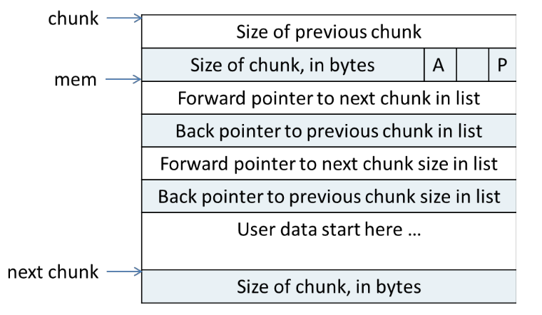

# Week 1

## Day1: 学习CTF Wiki栈溢出基础和ROP基础

> 传送门: [CTF Wiki: Linux Pwn](https://ctf-wiki.github.io/ctf-wiki/pwn/readme-zh/)

- [x] [Stack Overflow Principle](https://ctf-wiki.github.io/ctf-wiki/pwn/linux/stackoverflow/stackoverflow-basic-zh/): 通过栈溢出覆盖掉函数栈帧的返回地址, 当函数返回时就会跳入攻击者覆写的地址继续执行代码. 
  
    1. 确认溢出的长度可以到达栈帧返回地址
    2. 确认没有开启Stack Canary
    3. 确认覆写的地址所在的段具有执行权限
    * 编译选项`-fno-stack-protector`用于关闭Stack Canary
    * 编译时需要加`-no-pie`确保不会生成位置无关文件
    *  关闭ASLR: `echo 0 > /proc/sys/kernel/randomize_va_space`
- [x] [Basic ROP](https://ctf-wiki.github.io/ctf-wiki/pwn/linux/stackoverflow/basic-rop-zh/): 在栈溢出的基础上, 通过利用文件本身的gadget来控制寄存器和变量来控制程序流程.
    - [x] ret2text: 跳转到程序已有的高危代码处(`system("/bin/sh")`), 直接触发高危操作.
    - [x] ret2shellcode: 栈溢出的同时布置shellcode(可以理解为预写好的高危功能性汇编代码), 在溢出时跳转到布置好的shellcode处继续执行.
        1. 因为有执行, 所以需要确保shellcode所在位置有可执行权限.
        2. gef的`vmmap`可以查看内存段的权限.
        3. pwntool获取shellcode: `asm(shellcraft.sh())`
    - [x] ret2syscall: 没有执行权限时, 可以通过系统调用来实现控制. 
        1. 开启NX保护后, 再如何部署高危代码都没法执行. 所以需要转向利用内核的系统调用实现高危操作. 
        2. 可以通过`/usr/include/asm/unistd_32.h`查看当前内核对应的系统调用号. 比如`#define __NR_execve 11`, 也就是`execve`的系统调用号为`0xb`
        3. 使用`ROPgadget`可用获取寄存器和字符串的gadget.
           * `ROPgadget --binary rop  --only 'pop|ret' | grep 'ebx' | grep 'ecx'`
           * `ROPgadget --binary rop  --string '/bin/sh'`
           * `ROPgadget --binary rop  --only 'int'`
        4. 使用`flat`来直观地表示ROP链: `flat(['A' * 112, pop_eax_ret, 0xb, pop_edx_ecx_ebx_ret, 0, 0, binsh, int_0x80])` 
           * 形式为: `溢出用的填充数据, gadget1(函数原本的返回地址), value1, gadget2, value2, ... , int 0x80`  
    - [x] ret2libc: 
        - [x] ret2libc1: 跳转到libc的高危代码(`system`)并模拟函数调用
            1. 注意跳转到libc的函数去执行, 需要模拟函数调用, 因此跟gadget在栈上的部署方式不一样, 正确的形式为`PLT地址, 函数返回地址, 函数参数地址...`
            2. 获取`system()`的plt地址方法: `objdump -d ret2libc1 | grep system`, 也就是地址是写在汇编里的.
        - [x] ret2libc2: 如果缺少函数调用的条件(缺少函数参数字符串`/bin/sh`)
            1. 利用libc里的`gets`函数, 并手动输入相应的函数参数字符串即可弥补.
            2. `['a' * 112, gets_plt, pop_ebx, buf2, system_plt, 0xdeadbeef, buf2]`需要注意的是`pop_ebx`作为`gets`的返回地址, 它还将buf2给弹出栈, 使得程序继续向下执行`system`函数部分.
        - [x] ret2libc3: 既没有函数参数字符串(`/bin/sh`)也没有高危libc函数地址(`system`)
            1. libc之间函数偏移是固定的, 因此可以通过某个已知的libc函数偏移, 来获取任意其他libc函数地址. 
            2. libc有延迟绑定机制, 只有执行过的函数它的GOT才是正确的. 
            3. libc内自带有`/bin/sh`字符串. 
            4. 可以利用`__libc_start_main`地址来泄露偏移.
            5. 利用思路就是 => 构造ROP链通过`puts`泄露`__libc_start_main`的got地址 => 使用`LibcSearcher`获取libc的基址从而获取`system`地址和`/bin/sh`地址 => 重载程序 => 构造payload控制.


## Day2: 学习CTF Wiki中级ROP和格式化字符串漏洞

> 传送门: [CTF Wiki: Linux Pwn](https://ctf-wiki.github.io/ctf-wiki/pwn/readme-zh/)

- [x] [Intermediate ROP](https://ctf-wiki.github.io/ctf-wiki/pwn/linux/stackoverflow/medium-rop-zh/):
    - [x] [ret2csu](https://ctf-wiki.github.io/ctf-wiki/pwn/linux/stackoverflow/medium-rop-zh/#_1):
        * x64寄存器传参的顺序为`rdi, rsi, rdx, rcx, r8, r9`, 超出数量的参数根据函数调用约定压入栈中(比如从右向左压栈)
        * `__libc_csu_init`是`__libc_start_main`调用的用于初始化的函数. 参考: [Linux X86 程序启动–main函数是如何被执行的？](https://luomuxiaoxiao.com/?p=516)
        * 示例的level5应是[ctf-challenges](https://github.com/ctf-wiki/ctf-challenges)里的[hitcon-level5](https://raw.githubusercontent.com/ctf-wiki/ctf-challenges/master/pwn/stackoverflow/ret2__libc_csu_init/hitcon-level5/level5), 而非蒸米提供的[level5](https://github.com/zhengmin1989/ROP_STEP_BY_STEP/tree/master/linux_x64)
        * 使用`ROPgadget`搜索可用的gadget是可以发现, 程序并没有直接的控制传参用的寄存器, 大多都是控制`r12-r15`, 这也就是分析`__libc_csu_init`的关键: 我们需要其中的`mov`语句, 通过`r13-r15`控制x64传参用的前三个寄存器.
        * 分析`__libc_csu_init`的目的是掌握可控制的寄存器, 也就是能控制`rbx, rbp, r12, r13=>rdx, r14=>rsi, r15=>edi`, 同时可控的`r12`和`rbx`以及`call qword ptr [r12+rbx*8]`能控制调用的函数地址(`r12`为函数地址, `rbx`直接为0). `add rbx, 1; cmp rbx, rbp; jnz 400600`则是约束条件`rbx+1==rbp`, 故而`rbx=0则rbp=1`. 这样来看这是一段非常优雅的`gadget`. 
        * `write (fd, &buf, count)`中, linux下`fd=0/1/2`分别对应`stdin/stdout/stderr`. 
        1. libc延迟绑定机制, 因此需要等待`write`输出`Hello, World`后泄露函数地址. 
        2. 泄露函数地址后获取libc基址, 然后获取`execve`地址
        3. 利用csu执行`read()`向bss段写入`execve`地址和参数`/bin/sh`
        4. 利用csu执行`execve(/bin/sh)`
        <details>
        <summary>Q1: 为什么要先<code>read()</code>写<code>execve</code>地址, 而不是直接调用<code>execve</code>函数呢?</summary>
        因为<code>call qword ptr [r12+rbx*8]</code>指令, 实际上我们通过csu控制的是一个地址, 而该地址指向的内容才是真正函数的调用地址. 而<code>read()</code>写到bss段的是<code>execve</code>的地址, 但csu调用的时候提供的是bss段的地址, 这样才能完成函数调用. 如果直接传<code>execve</code>地址, 那么是无法调用成功的.
        </details>
        <details>
        <summary>Q2: 为什么可以用写入的<code>/bin/sh</code>地址能成功, 而直接用libc内的<code>/bin/sh</code>地址就不能成功呢?</summary>
        我一个可能性比较高的推测是, 回顾我们的gadget, 对于x64传参的第一个寄存器<code>rdi</code>, 其实我们的gadget只能控制寄存器<code>rdi</code>的低32位(<code>edi</code>). 而对于bss段地址来说, 它实际上是一个32位的地址(高32位为0), 而libc内的<code>/bin/sh</code>是一个64位的地址(高32位不为0), 所以没有办法传递完整的地址进去. 所以只能通过bss上写入的<code>/bin/sh</code>地址进行传参. 
        </details>
        <details>
        <summary>csu函数实现</summary>

        ``` python
        def csu(func_addr, arg3, arg2, arg1, ret_addr):
           rbx = 0
           rbp = 1
           r12 = func_addr
           r13 = arg3
           r14 = arg2
           r15 = arg1
        
           # pop rbx rbp r12 r13 r14 r15 retn
           csu_pop_gadget = 0x000000000040061A

           # r13=>rdx r14=>rsi r15=>edi 
           # call func
           # rbx+1 == rbp
           # add rsp, 8
           # csu_pop_gadget
           csu_mov_gadget = 0x0000000000400600

           # pop 6 registers and `add rsp, 8`
           stack_balance = b'\x90' * 0x8 * (6+1)

           payload = flat([
               b'\x90'*0x80, b'fake_rbp', p64(csu_pop_gadget),
               p64(rbx), p64(rbp), p64(r12), p64(r13), p64(r14), p64(r15),
               p64(csu_mov_gadget), stack_balance, p64(ret_addr)
           ])

           io.send(payload)
           sleep(1)
        ```
        </details>
    - [x] [BROP](https://ctf-wiki.github.io/ctf-wiki/pwn/linux/stackoverflow/medium-rop-zh/#brop): 盲打的方式通过程序是否崩溃来推测信息. 适用于Nginx, MySQL, Apache, OpenSSH等服务器应用, 因此该攻击还有着一定的实际应用价值.
        > 理论知识主要参考 [Blind Return Oriented Programming (BROP) Attack-攻击原理](https://wooyun.js.org/drops/Blind%20Return%20Oriented%20Programming%20(BROP)%20Attack%20-%20%E6%94%BB%E5%87%BB%E5%8E%9F%E7%90%86.html), 示例程序参考 [HCTF2016-出题人失踪了(brop)](https://github.com/ctf-wiki/ctf-challenges/tree/master/pwn/stackoverflow/brop/hctf2016-brop)
        * 实现攻击必需的2个条件:
            1. 存在栈溢出漏洞, 且攻击者可以通过输入轻松触发. (没有程序没有源码没有信息, 打也打不崩, 那还玩什么)
            2. 程序崩溃后会重新运行, 并且重新运行的进程地址不会再次随机化. (能稳定复现, 获取稳定地址, 包括Stack Canary也不能随机化)
        * 描述了4种gadget:
            1. stop gadget: 程序跳转到该gadget片段后, 程序并没有崩溃, 而是进入某种hang/loop状态, 能与攻击者保持连接. 
            2. (potentially) useful gadget: 找到stop gadget后, 通过一定的内存布局而发现的更多的`不会崩溃`的gadget. (当然包括新发现的stop gadget)
            3. brop gadget: 一种特殊的`useful gadget`, 能帮助我们控制x64传参用的寄存器. 典型示例就是`__libc_csu_init()`尾部的rop链. gadget能通过指令错位(`+7/+9`)的方式得到单独控制`rsi`和`rdi`寄存器的新gadget.
            4. trap gadget: 就是会让程序崩溃的gadget. 
        * 攻击思路:
            1. 通过爆破, 获取程序崩溃时的字符串填充长度. 
            2. 通过单字节枚举, 逐字节地泄露出栈上保存的`Canary`. (当然也可以枚举出栈上保存的寄存器和原本的返回地址.)
            3. 寻找`stop gadget`: 早期能得到的信息只有程序崩溃和不崩溃, 所以我们需要获得第一个程序不会崩溃的stop gadget. 
            4. 寻找`useful gadget`: 通过合理的布局栈上的内存, 我们可以利用`stop gadget`来发掘更多的`useful gadget`, 并且是能确认该`useful gadget`弹栈数量的.
                * 比如栈上的布局情况为: `...| buffer | gadget | trap x N | stop | trap|...`  则表明该gadget有`N`个pop指令(`N=0,1,...`).
            5. 从`useful gadget`里筛选出真正有帮助的`brop gadget`. 这里就以`__libc_csu_init()`的尾部gadget为例, 该gadget能弹栈`6`次, 通常认为符合这种性质的gadget很少, 所以有一定把握去判断, 并且该gadget可以通过错位得到单独控制`rsi`和`rdi`的gadget, 也可以通过`减去0x1a`来获取其上的另一个gadget. 
            6. 寻找`PLT`项. PLT在盲打时有这样的特征: 每一项都有`3`条指令共`16`个字节长. 偏移`0`字节处指向`fast path`, 偏移`6`字节处指向`slow path`. 如果盲打时发现有连续的`16`字节对齐的地址都不会造成程序崩溃, 这些地址加`6`后也不会崩溃. 那么就推断为`PLT`地址. 
            7. 确定`PLT`项内的`strcmp`和`write(也可以是put)`: 
               * 确定`strcmp`的目的在于: 目前只能通过`brop gadget`控制传参用的前2个寄存器(rdi和rsi), 第3个寄存器`rdx`尚且没法用gadget控制. 因此转变思路通过`strcmp`和控制字符串长度来给`rdx`赋值, 变相控制第三个传参用的寄存器.
               * 确定`write`的目的在于: 需要通过`write`将内存代码都写回给攻击者. 通常是将`fd`设置为连接的`socket描述符`. 而`write`需要3个参数, 这也是为什么借用`strcmp`控制`rdx`的原因. 
               * 确定`strcmp`的方法在于控制函数的两个地址: `readable`和`bad(0x00)`地址. 这样就有`4`种参数形式, 并且只有两个参数地址都是`readable`时函数才会正确执行, 其他情况都没有正确执行, 那么就推断这个plt项对应的是`strcmp`. 
               * 确定`write`的方法在于确定写入的`fd`, 就只能尽量枚举文件描述符来测试了. 建议用较大的文件描述符数字. 
               * 如果是寻找`puts`的话, 就比较容易确定. 因为我们只需要控制输出`0x400000`地址的内容, 该地址通常为ELF文件的头部, 内容为`\x7fELF`. 构造的payload形式为`buffer |pop_rdi_ret | 0x400000 | puts_addr | stop`. 
            8. 有能力控制输出函数后, 攻击者可以输出更多的.text段代码. 也可以去寻找一些其他函数, 比如`dup2`或`execve`等:
               * 将`socket`输出重定向到`stdin/stdout`.
               * 寻找`/bin/sh`, 或者利用`write`写入到某块内存.
               * 执行`execve`或构造系统调用. 
               * 泄露`puts`在内存的实际地址, 然后确认libc基址, 获取`system`地址并构造rop链.
- [x] [Format String Vulnerability](https://ctf-wiki.github.io/ctf-wiki/pwn/linux/fmtstr/fmtstr_intro-zh/):
    * 格式化字符串漏洞的本质在于信任了用户的输入, 攻击者通过输入构造好的格式化字符串来泄露栈上的内存数据.
        * `%x`或`%p`用于泄露栈内存数据.
        * `%s`用于泄露变量对应地址的内容, 存在`\x00`截断.
        * `%n$x`用于泄露输出函数的第`n+1`个参数. 这里的`n`是相对于格式化字符串而言的. 
    * 可以通过`func@plt%N$s`将内存中的`func`实际地址泄露出来. `N`表示其在栈上相对格式化字符串而言是第`N`个参数.
    * 确定了偏移后, 使用`...[overwrite addr]....%[overwrite offset]$n`. `%n`写入的值可通过增加输出的字符数量进行调整.
    * 覆写的地址没有位置的要求, 只需要找到对应偏移即可. 
    * 利用`%hhn`进行单字节写入, `%hn`进行双字节写入.


## Day3: 回顾软件安全保护技术和学习ARM汇编基础

- [x] 软件保护技术: 
    - [x] 反调试:
        * 利用WinAPI检测调试状态: [IsDebuggerPresent](https://ctf-wiki.github.io/ctf-wiki/reverse/windows/anti-debug/isdebuggerpresent-zh/).
        * 内存数据检查: 比如通过`PEB`的字段(`BeingDebug`), 堆上的标志信息([Heap flags](https://ctf-wiki.github.io/ctf-wiki/reverse/windows/anti-debug/heap-flags-zh/))来检测调试.
        * 调试驱动检测: 基于一些使用了驱动的调试器的行为特征, 比如`调试器会在启动后创建相应的驱动链接符号`, 来确定是否存在调试器.
        * [进程窗口检测](https://ctf-wiki.github.io/ctf-wiki/reverse/windows/anti-debug/example-zh/#_3): 比如枚举当前所有进程名/窗口名来检查是否存在已知调试器.
        * 特征码检测: 枚举当前所有正在运行的进程, 匹配特定调试器的内存代码数据来判断是否有调试器. 
        * [时间差检测](https://ctf-wiki.github.io/ctf-wiki/reverse/windows/anti-debug/example-zh/#_2): 通过调试和非调试模式下程序运行的时间差异来判断是否存在调试. 
        * 断点检测/[异常检测](https://ctf-wiki.github.io/ctf-wiki/reverse/windows/anti-debug/example-zh/#seh): 断点检测在于判断内存代码是否被修改为`int3`, `int 2d`等软中断指令, 异常检测在于故意触发异常,如果调试器接管了异常则认定为存在调试器.
        * 功能破坏: 基于大部分程序通常都不会使用系统提供的调试功能这一假设, 保证程序正常运行的前提下, 破坏系统提供的调试相关功能. 比如在创建线程时指定`ThreadHideFromDebugger`属性可以隐藏线程引发的异常, 接收不到异常调试器就无法正常工作. 
        * 双进程保护: 基于一个进程只能同时被一个调试器调试的前提, 以调试方式启动被保护的程序, 通过占用调试行为的方式来阻止攻击者去调试分析受保护程序.
    - [x] 反虚拟机: 
        * BIOS信息检测: 虚拟机软件厂商的BIOS通常具有明显的品牌特征. 
        * 字符串特征检测: 虚拟机产品明显的字符串特征.
        * [后门端口检测](https://ctf-wiki.github.io/ctf-wiki/reverse/windows/anti-debug/example-zh/#vmware): 比如VMWARE的后门I/O端口`0x5658("VX")`读取数据得到`VMXh`
    - [x] 数据校验:
        * 文件校验: 实现计算好程序文件的校验值, 然后运行时再校验比对判断文件本身是否被修改. 
        * 内存校验: 通常程序运行时, `.text/.rsrc`等区段是不会修改的, 通过运行时计算内存数据的校验值来判断内存数据是否被修改.
    - [x] 导入表加密: 保护导入表能阻止攻击者去获取对应的符号信息, 增大分析难度. 
        1. 可以简单地劫持导入表函数调用处来隐藏调试器/反汇编器提供的符号信息.
        2. 也可以预先将导入表函数地址加密存储到某个位置, 然后将导入表RVA指向解密代码, 解密代码运行后得到真实的函数地址, 并跳转过去执行.
        3. 另一种方式就是, 将导入表函数的入口代码进行加密或虚拟化, 在运行时解密.
        4. IAT模拟: 自己实现一些程序可能调用的外部函数, 然后替换导入表内的原始函数.
    - [x] 模块拷贝移位: 用于对抗代码Hook的技术, 方法是复制移位模块, 然后映射模块内的数据到内存以及重定位, 替换原模块函数调用地址.
    - [x] 资源加密: 
        1. 在程序运行时将资源解压/解密, 然后修正PE文件头的资源指向.
        2. Hook各种与资源相关的函数, 然后在调用函数时动态解密资源.
    - [x] 代码加密: 代码加密的目的是将原始代码转换为等价的, 极其复杂的, 更多的代码. 
        * 代码膨胀/变形: 将1条或多条指令转变为等价的其他指令, 更多是用于膨胀. 
        * [垃圾代码(花指令)](https://ctf-wiki.github.io/ctf-wiki/reverse/windows/anti-debug/junk-code-zh/): 目的也是膨胀, 但是方式就是插入无用的或者干扰(误导)调试器反汇编算法的代码. 
        * 代码乱序(平坦化): 通过跳转指令打乱指令的正常顺序, 增大分析难度.
        * 多分支: 也是花指令的一种, 只是这里的花指令着重在分支跳转指令上, 这些分支跳转大部分是根本不会执行的deadcode, 但是会让攻击者在分析时难以确定代码的具体执行流程.
        * call链: 通过call指令来打乱执行流程. 
    - [x] 代码虚拟化: 设计一套虚拟机和对应的opcode来在保证语义的前提下, 模拟原本的指令. 
        虚拟机本质也是程序代码, 运行虚拟机本身也会影响当前的上下文, 因此虚拟机设计时需要保存/恢复上下文, 解决虚拟机和原始代码在上下文的使用冲突. 通常有以下两种方案:
        * 堆机: 开辟新的栈空间来运行虚拟机代码, 代码执行完后恢复原始的栈空间地址即可. 
        * 栈机: 不开辟新空间, 在原有栈空间分出一部分专门给虚拟机使用, 并避免原始指令影响到虚拟机专用的栈空间.
    * 脚本引擎: 将程序的部分功能分交给脚本引擎解释执行.
    * 网络加密: 将程序的部分代码放到服务器执行, 服务器只返回代码的执行结果. 
    * 硬件加密: 类似网络加密, 只是将关键数据/代码转移到了硬件介质里.
    * 代码签名: 利用签名严重算法, 对程序文件数据进行签名, 将对这些签名的校验作为能否运行该软件的判断条件.
- [x] [ARM汇编基础](https://azeria-labs.com/writing-arm-assembly-part-1/)
    - [x] [Introduction to ARM Assembly](https://azeria-labs.com/writing-arm-assembly-part-1/)
        * ARM为RISC指令, 相比CISC具有精简的指令和更多的通用寄存器.
        * ARM只能使用操作寄存器的指令, 并且使用`Load/Store`模型访问内存(也就是只有`Load/Store`指令能访问内存). 
        * 指令精简可以带来更快的运行速度, 但同时在可用指令有限的情况下难以高效地编写软件. 
        * ARM有两种模式`ARM模式`和`Thumb模式`. `Thumb模式`下的指令长度既可以是`2字节`也可以是`4字节`.
        * `ARMv3`前使用`小端`, 之后支持`双端`并且可以切换字节序.
    - [x] [Data Types Registers](https://azeria-labs.com/arm-data-types-and-registers-part-2/)
        * `s`后缀表示`signed`, `b`表示`byte`长度为8, `h`表示`halfword`长度为16. ARM的`word`是`32`位长.
        * 大小端的切换由`CPSR`寄存器的第`9`位`E`来指示. 
        * 寄存器数量取决于ARM的版本. 通常有`30`个32位寄存器, 前`16`个寄存器用户模式下可用, 其他寄存器只有特权模式下可用. 
          * `R0-R6`为通用寄存器, 其中`R0`对应`EAX`
          * `R7`用于保存系统调用号
          * `R8-R10`也是通用寄存器
          * `R11(FP)`类似于`EBP`, 也就是栈基寄存器
          * `R12(IP)`即`Intra Procedural Call`内部过程调用寄存器.(x86没有接触过呢)
          * `R13(SP)`类似于`ESP`, 也就是栈顶寄存器
          * `R14(LR)`:即`Link Register`, 链接寄存器
          * `R15(PC)`: 程序计数器, 类似于`EIP`.
          * `CPSR`: 当前程序状态寄存器, 类似于`EFLAGS`.
        * ARM上的函数调用约定: 前四个参数存储在寄存器`R0-R3`中.
        * 链接寄存器`R14(LR)`: 据[解释](https://baike.baidu.com/item/%E9%93%BE%E6%8E%A5%E5%AF%84%E5%AD%98%E5%99%A8/8767852?fr=aladdin), `LR`实际上是函数调用时用于保存函数的返回地址, 意义在于快速进入和返回`叶函数`. 
        * 程序计数器`R15(PC)`: ARM模式下指令长度为4, Thumb模式下长度为2. PC会根据所处模式来递增相应的指令长度. 执行分支指令时, 会将分支跳转的目的地址保存到`PC`. 但程序执行过程中, `PC`存储的总是当前执行指令的`后2条`指令(ARM模式就+8, Thumb模式就+4).

## Day4: 学习ARM汇编基础和CTF Wiki的花式ROP

> 传送门: [azeria-labs](https://azeria-labs.com/writing-arm-assembly-part-1/) / [ROP Tricks](https://ctf-wiki.github.io/ctf-wiki/pwn/linux/stackoverflow/fancy-rop-zh/)

- [x] [ARM Assembly](https://azeria-labs.com/writing-arm-assembly-part-1/)
    - [x] [ARM Instruction Set](https://azeria-labs.com/arm-instruction-set-part-3/)
        * ARM模式亦或是Thumb模式跟所处的特权等级无关. 
        * 开发ARM Shellcode时需要尽量避免`NULL`空字节出现, 因此常用Thumb指令
        * ARM版本之间会有略微差别, 需要根据对应版本查询[官方文档](http://infocenter.arm.com/help/index.jsp)
        * Thumb有三个版本:
            1. Thumb-1: 16比特长, 用于ARMv6及早期版本
            2. Thumb-2: 16/32比特长, 扩展了Thumb-1, 支持更多的指令. 适用于`ARMv6T2`和`ARMv7`.
            3. ThumbEE: 包括一些对动态生成代码的变化.
        * ARM和Thumb指令的区别:
            1. 条件执行: ARM所有指令都可以条件执行, Thumb只能通过`IT`指令允许部分指令有条件地执行.
            2. 32位表示: 32位的Thumb指令会多一个`.w`的后缀
            3. 桶式移位器(ARM独有特性): 能用于精简指令. 
        * 要切换处理器执行状态, 需要满足以下两者条件其一:
            1. 使用分支指令`BX`或`BLX`并将目标寄存器的最低有效位设置为`1`(通过`+1`实现)
            2. 状态寄存器置位T
        * ARM汇编指令格式`MNEMONIC{S}{condition} {Rd}, Operand1, Operand2`. 注意`Operand2`的使用稍有灵活, 并且有些指令中`Operand1`是隐含的.
    - [x] [Memory Instructions: Loading and Storing Data](https://azeria-labs.com/memory-instructions-load-and-store-part-4/)
        * `[pc, #12]`表示`pc`相对寻址. 不过要注意, ARM里的`pc`指的是当前指令的下`2`条指令位置, 也就是ARM模式下`+8`, Thumb模式下`+4`
        * 地址模式: offset / pre-indexed / post-indexed
            * 以`立即数`作为偏移的情况:
                * `str r2, [r1, #2]`: 地址模式: offset. 直接将r2寄存器中的值存到`r1+2`所表示的地址处. `r1`没有变化
                * `str r2, [r1, #4]!`: 地址模式: pre-indexed(`!`是一个标识的特征). 类似offset寻址模式, 寻址`r1+4`, 寻址存储完执行`r1=r1+4`
                * `ldr r3, [r1], #4`: 地址模式: post-indexed. 寻址`r1`, 寻址完执行`r1=r1+4`
            * 以`寄存器`作为偏移的情况: 类似立即数作偏移的情况, 很好理解. 
            * 以`移位寄存器`作为偏移的情况: 类似立即数作偏移的情况, 不过移位的优先级是最高的, 比如`str r2, [r1, r2, LSL#2]`就是将r2内的值保存到`r1+r2<<2`的地址处.
        * ARM使用立即数: ARM使用立即数的方式很不灵活, 格式为`v = n ror 2*r` 其中`n in [0-255]`, `r in [0-30]`. 对于不能合规的立即数, 考虑拆分成两个更小的数加起来, 或者使用`LDR`指令比如`LDR r1, =511`
    - [x] [Load and Store Multiple](https://azeria-labs.com/load-and-store-multiple-part-5/)
        * 多次加载/存储可以使用`LDM`和`STM`指令
        * `LDM`和`LDR`的方向是相反的, 同样`STM`和`STR`方向也相反
        * 扩展`-IA (increase after), -IB (increase before), -DA (decrease after), -DB (decrease before)`
        * `PUSH`和`POP`和x86汇编基本一致. 
        * `PUSH`等价于`STMDB sp! reglist`
        * `POP`等价于`LDMIA sp! reglist`
    - [x] [Conditional Execution and Branching](https://azeria-labs.com/arm-conditional-execution-and-branching-part-6/)
        * 分支条件在标志寄存器中会相应地置位, 这点跟x86一致, 区别主要在标志寄存器各个位的含义略有不同. ARM的分支通过在指令后加相应的条件码来实现.
            | Condition Code | Meaning (for cmp or subs)              | Status of Flags  |
            | -------------- | -------------------------------------- | ---------------- |
            | CS or HS       | Unsigned Higher or Same (or Carry Set) | C==1             |
            | CC or LO       | Unsigned Lower (or Carry Clear)        | C==0             |
            | MI             | Negative (or Minus)                    | N==1             |
            | PL             | Positive (or Plus)                     | N==0             |
            | AL             | Always executed                        | -                |
            | NV             | Never executed                         | -                |
            | VS             | Signed Overflow                        | V==1             |
            | VC             | No signed Overflow                     | V==0             |
            | HI             | Unsigned Higher                        | (C==1) && (Z==0) |
            | LS             | Unsigned Lower or same                 | (C==0)           |  | (Z==0) |
        * `IT`是`IF-Then-(Else)`的缩写.
        * `IT`指令格式: `IT{x{y{z}}} cond`, 也就是最多可以有条件地执行`4`条指令
            * `cond`指定`IT`块中第`1`条指令的条件
            * `x`指定第`2`条指令的条件, `y`指定第`3`条, `z`指定第`4`条
        * `IT`块里`T`的条件要跟`I`保持一致, `E`的条件要跟`I`和`T`相反. (这也很好理解, 就是ARM划分分支的一种形式)
        * 条件码的反义就不硬背了, 直接看`ITE`就可以判断`IT`块里的情况. 
        * `branch`指令跟x86的类似, 只是助记符不一致, 理解还是很好理解的. 
            * `B`: 单纯跳转分支
            * `BL`: 将`PC+4`保存到`LR`然后跳转分支
            * `BX/BLX`: 相比多了一个`Exchange`, 也就是切换指令集(`ARM <-> Thumb`)
            * `BX/BLX`通常会使用类似`add r2, pc, #1; bx r2`的方法先取`pc`然后`+1`的方法使最低有效位置为1(`0`转ARM，`1`转Thumb), 然后用`BX/BLX`切换指令集. (这里不用担心内存块对齐`4`的问题, CPU会自动屏蔽没有对齐的那个bit1/0). 
    - [x] [Stack and Functions](https://azeria-labs.com/functions-and-the-stack-part-7/)
        * 栈的部分不必多说
        * 函数部分熟悉`Prologue`, `Body`和`Epilogue`
            * `prologue`: `push {r11, lr}; add r11, sp, #0; sub sp, sp, #16`
            * `body`: `mov r0, #1; mov r1, #2; bl max`
            * `epilogue`: `sub sp, r11, #0; pop {r11, pc}`
- [x] [ROP Tricks](https://ctf-wiki.github.io/ctf-wiki/pwn/linux/stackoverflow/fancy-rop-zh/)
    - [x] [stack pivoting](https://ctf-wiki.github.io/ctf-wiki/pwn/linux/stackoverflow/fancy-rop-zh/#stack-pivoting)
        * 直接劫持栈指针指向攻击者的内存, 可以以较少的指令达成攻击, 对于开启PIE保护的程序也可以适用. 
        * 利用的gadget为`pop rsp/esp`, 也可以通过`libc_csu_init`的gadget经过错位获得. 
        * 有办法控制到`esp`后, 还需要想办法将`esp`的值指向写入的shellcode部分. 可以加`\x90`垫.
    - [x] [Stack smash](https://ctf-wiki.github.io/ctf-wiki/pwn/linux/stackoverflow/fancy-rop-zh/#stack-smash)
        * Canary检查到溢出后, 程序会执行`__stack_chk_fail`函数打印`argv[0]`指针. 而攻击思路就是借栈溢出覆盖`argv[0]`实现信息泄露. 
        * 攻击需要确定溢出到`argv[0]`所需要的字节数, 以及需要溢出的地址. 

## Day5: 学习CTF Wiki整数溢出和堆管理机制

> 在此前需要了解glibc的堆内存管理器的机制. 主要参考 [glibc内存管理ptmalloc源代码分析](https://paper.seebug.org/papers/Archive/refs/heap/). Seebug有一个[堆资料的归档](https://paper.seebug.org/papers/Archive/refs/heap/)也可以省下找资料的功夫. 

- [x] 整数溢出:
    * 上界溢出: 上界溢出能使得数值变得极小, 有符号整数`正极大=>0`, 无符号整数`正极大=>负极小`
    * 下界溢出: 跟上界溢出相反, 有符号整数`0=>正极大`, 无符号整数从`负极小=>正极大`
    * `错误的类型转换`和`没有严格限制数值范围`是造成整数溢出的两个常见原因. 
- [x] 堆溢出基础:
    * `malloc(size_t n)`:
        * 返回指针, 指向新分配的`至少为n字节`的内存块地址. 
        * 如果`n=0`, 返回系统允许的`最小块`. 通常32位下是`16字节`, 64位下是`24或32字节`. 
        * `size_t`通常是无符号整数, 因此`n<0`会造成整数溢出变成非常大的值, 而malloc通常也会因为分配不了这么大的内存而失败. 
    * `free(void* p)`:
        * 释放由`p`指向的内存块. 
        * 当`p=Null`时, `free`不会进行任何操作
        * `p`被`double free`后造成漏洞. 
        * 当释放很大的内存块时, 会将该内存还给系统
    * 系统调用`(s)brk / mmap`: `malloc`和`free`都是通过系统调用来分配释放内存.
        * `(s)brk`: 可以通过增加`brk`的大小来向操作系统申请内存. 比如`curr_brk = sbrk(0); brk(curr_brk+4096);`就可以在`curr_brk`的基础上新增加`0x1000`的堆内存空间.
        * 查看堆内存可以根据进程的`pid`号去`cat /proc/[pid]/maps`查看.
        * `mmap`: `mmap`相比`brk`的操作粒度更细一些, 有几个可以控制的参数. 类似`mmap(NULL, (size_t)132*1024, PROT_READ|PROT_WRITE, MAP_PRIVATE | MAP_ANONYMOUS, -1, 0)`
        * `dlmalloc`所有的线程都`共享一个堆`, 因此不支持多线程, 如果两个线程同时申请内存, 就只能一个线程进入`临界区`, 另一个线程等待. 
        * 操作系统倾向于第一次直接分配一个大内存给程序, 避免多次分配内存(切换内核态和用户态)开销. 同时释放的内存也不会立即回收, 而是交由glibc继续管理. 
- [x] [ptmalloc源代码分析](https://paper.seebug.org/papers/Archive/refs/heap/glibc%E5%86%85%E5%AD%98%E7%AE%A1%E7%90%86ptmalloc%E6%BA%90%E4%BB%A3%E7%A0%81%E5%88%86%E6%9E%90.pdf):
    - [x] 基础知识
        - [x] x86平台Linux进程内存布局:
            * 32位Linux会将ELF载入到`0x8048000(128M)`
            * `.bss`段与`stack`之间的空间分为两部分: `heap`和`mmap region`
            * `stack`和`mmap region`都是反向生长(`高地址=>低地址`), `heap`是正向`低地址=>高地址`
        - [x] 操作系统内存分配的相关函数: 
            * 内存的**延迟分配**: 只有在真正访问一个地址的时候才建立这个地址的物理映射. Linux内核在用户申请内存时分配的是一个线性区(虚拟内存), 只有当用户使用这块内存的时候内核才会分配具体的物理页面给用户. 而物理页面的释放也是通过释放线性区, 找到其对应的物理页面, 将其全部释放. 
            - [x] Heap相关函数: 
                * `int brk(void *addr);` brk()是一个非常简单的系统调用, 仅仅只是改变`mm_struct`结构的成员变量`brk`的值
                * `void *sbrk(intptr_t increment);` 注意`increment=0`时, sbrk()返回的是进程当前brk值, `increment>0`时扩展brk, `increment<0`时收缩brk.
            - [x] Mmap相关函数:
                * `void *mmap(void *addr, size_t length, int prot, int flags, int fd, off_t offset);` 将一个文件或其他对象映射进内存
                    * `prot`是内存保护标志: 有`PROT_EXEC`, `PROT_READ`, `PROT_WRITE`, `PROT_NONE`.
                    * `flags`: 指定映射对象的类型, 映射选项和映射页是否可以共享. (不太懂什么含义先忽略)
    - [x] 概述: 
        - [x] 内存管理方法: 
            1. C风格的内存管理: 实现`malloc`和`free`函数, 通过调用`brk()`和`mmap()`来管理内存. 但是需要程序员手动管理内存, 繁琐复杂困难. 
            2. 池式内存管理: 为程序的每个特定阶段分配特定的内存. 优点是简单快速易于实现, 缺点是只适用于操作分阶段的程序, 兼容性差难以维护.
            3. 引用计数: 通过标记引用次数来判断数据结构是否存活.
            4. 垃圾回收: 垃圾回收会在可用内存减少到一定程度时才会启动, 首先以程序所知的"可用数据"(栈数据,全局变量,寄存器)出发, 去追踪相应存活的数据. 没有找到的其他数据就被标记为垃圾进行销毁. 

## Day6: ptmalloc2内存管理机制(分配和释放)

- [x] ptmalloc2内存管理概述
    - [x] 内存管理的设计假设
        1. 对`长生命周期`的`大内存`分配使用`mmap`, `特别大`的内存总是使用`mmap`, `短生命周期`的内存分配用`brk`
        2. 尽量缓存临时使用的`空闲小内存块`, `大内存`或`长生命周期`内存释放时则直接返还系统
        3. `空闲小内存`只会在`malloc`和`free`期间进行合并, `free`时空闲内存块`可能放回pool而非返还系统`
        4. 收缩堆的条件: `当前free的chunk大小 + 前后能合并的chunk大小 > 64KB`并且`堆顶的大小达到阈值`
        5. 需要长期存储的程序不适合用ptmalloc管理内存
        6. 多个线程可以从同一个`arena`中分配内存. 
    - [x] 内存管理数据结构
        - [x] `main_arena`与`non_main_arena`
            * Doug Lea实现的内存分配器只有一个主分配区(`main_arena`), 因此每次分配内存为避免竞争都会加锁, 而这样会带来很大开销. 
            * `ptmalloc`增加了多个非主分配区(`non_main_arena`), `main_arena`和`non_main_arena`形成环形链表进行管理. 每一个`arena`利用互斥锁, 使`线程对于该arena的访问互斥`.
            * `main_arena`能访问进程的`heap`和`mmap`映射区域, 而`non_main_arena`只能访问`mmap`映射区域. 
            * 线程申请内存: 先查找线程私有变量看是否已经存在一个arena, 如果有就对该arena加锁然后分配内存, 如果没有, 就去循环链表找没加锁的arena. 如果arena都加锁了, 那么malloc就会开辟新的arena, 将该arena加入循环链表, 用该arena分配内存. 
        - [x] `chunk`的组织
            - [x] 使用中chunk结构:
                
                * `chunk指针`指向chunk的起始位置, 而`mem指针`才是真正返回给用户的指针. 
                * `P`: 表示前一个chunk是否在使用中. 
                  * `P=0`表示前一个chunk空闲, 这时chunk的第一个域`prev_size`才生效. `prev_size`用于找到前一个chunk的起始地址.
                  * `P=1`表示前一个chunk正在使用中, `prev_size`无效, 无法依据`prev_size`找到前一个块的位置(不会对前一个chunk进行任何操作)
                * `M`: 表示chunk从内存区域分配获得. `M=1`表示从`mmap映射区域`分配, `M=0`表示从`heap区域`分配.
                * `A`: 表示该chunk所属`arena`. `A=1`表示`non_main_arena`, `A=0`表示`main_arena`. 
            - [x] 空闲的chunk结构:
                
                * 空闲状态时没有`M`标志. 
                * `fd`指向`后一个空闲的`chunk, `bk`指向`前一个空闲`的chunk. `fd`和`bk`组合成双向链表. 
                * `large bin`中的空闲chunk, 还有额外两个指针`fd_nextsize`和`bk_nextsize`. 用于加快在`large bin`中`查找最近匹配的空闲chunk`. 
                * 不同的chunk链表使用`bins`或`fastbins`来组织. 
            - [x] chunk中的空间复用:
                * chunk之间复用一些无意义的域空间, 以尽量减小chunk所占空间. 
                * 一个chunk正在使用时, 它后一个chunk的`prev_size`肯定是无效的, 就可以把这个空间省下来. `inuse_chunk_size = (用户请求大小+8-4)对齐8`
        - [x] 空闲`chunk`容器
            - [x] `Bins`
                * 用户`free`的内存交由`ptmalloc`管理, 当用户下一次请求内存, ptmalloc就会从空闲内存里挑一块给用户, 减少了系统调用, 也就降低了开销. 
                * `ptmalloc`将`相似大小`的chunk用`双向链表`链接起来, 这样的链表称为`bin`
                * `ptmalloc`一共维护了`128`个bin并组成数组(array), 也就是对应了`128`个size. 
                * 假设数组索引从1开始, `array[1] = unsorted bin`, `array[2:64] = small bins`, `array[65:128] = large bins`
                * `small bins`: 
                    * 两个相邻的`small bin`中的chunk大小相差`8bytes`
                    * `small bin`里的chunk按`头进尾出`进行排列, 新释放的chunk存入链表的`头部`, 新申请的chunk从链表`尾部`取出. 
                * `large bins`: 
                    * 每一个`bin`分别包含`给定范围内的chunk`, chunk按大小排列, 相同大小的chunk按`头进尾出`排列. 
                    * ptmalloc会分配`符合要求的最小chunk`
                * 当空闲chunk链接到bin中, ptmalloc会把该chunk的`P`标志设为`0`(**注意: 这个标志实际上处在下一个`chunk`中**), 同时ptmalloc会检查它`前后的chunk`是否也是空闲的. 如果空闲, 就合并成大的chunk, 然后把合并后的chunk放到`unsorted bin`里去. 
                * 并非所有的chunk被释放后都放到bin中. ptmalloc为了效率会把一些小的chunk先放到`fast bins`里.
            - [x] `Fast Bins`
                * 小内存的分配总是频繁的, `fast bins`就是为此而引入
                * `size < max_fast(64B)`的chunk释放后放入`fast bins`内. 
                * `fast bins`内的chunk不会改变`P`标志位, 这样也就无法将其合并. 
                * 当需要小于`mas_fast`的chunk时, ptmalloc会首先在`fast bins`内找相应的空闲块, 找不到才会去`bins`里找. 
                * 在某个特定时间点, ptmalloc会遍历`fast bins`, 将相邻的空闲chunk进行合并, 将合并后的chunk加入`unsorted bin`中, 然后再将`unsorted bin`中的chunk加入`bins`中
            - [x] `Unsorted Bin`
                * `unsorted bin`可以看做是`bins`的一个缓冲区.
                * malloc时会优先查找`fast bins`, 然后找`unsorted bin`, 然后找`bins`. 
                * `unsoretd bin`找不到合适的chunk, malloc会将`unsorted bin`的chunk加入到`bins`, 然后从`bins`继续查找和分配.
            - [x] `Top chunk`
                * `top chunk`在`main_arena`和`non_main_arena`存在不一致的地方, 具体原因在于`main_arena`是唯一能映射进程heap区域的地方.
                * `top chunk`会在`fast bins`和`bins`都无法满足分配需求的时候使用, 如果`top chunk`也无法满足, 那么就系统调用一块新的, 然后和`top chunk`合并.
            - [x] `mmaped chunk`: 当申请的`chunk`足够大, `top chunk`也无法满足时, ptmalloc会使用`mmap`将页映射到进程空间, 这样的chunk在释放时则直接解除映射将内存返还系统. 
            - [x] `Last remainder`: 当需要分配一个`small chunk`但在`small bins`找不到合适的, 而`last remainder`的大小可以满足, 那么就切割`last remainder`成两个`chunk`, 一个大小合适的chunk返回给用户, 另一个chunk成为新的`last remainder`
        - [x] `sbrk`与`mmap`
            * ptmalloc在最开始时, 如果请求的空间小于`mmap`分配阈值, `main_arena`就使用`sbrk()`来分配内存作为heap. `non_main_arena`则使用`mmap`映射空间作为`sub-heap`. 
            * 之后就根据用户的分配释放来管理内存, 再遇上分配空间不足的情况, `main_arena`继续使用`sbrk`来增加heap大小(申请的大小得小于mmap分配阈值), `non_main_arena`则还是使用`mmap`映射新的`sub-heap`. 
    - [x] 内存分配概述
        1. 分配算法概述:
           * `size < 64B`: 用pool算法
           * `size in 64B...512B`: 在最佳匹配算法分配和pool算法分配取合适的
           * `size >= 512B`: 最佳匹配算法分配
           * `size >= mmap分配阈值(128KB)`: 如果没有动态调整过mmap分配阈值, 就按大于默认的128KB就直接调用mmap. 否则大于调整过的mmap阈值才调用mmap分配
        2. ptmalloc内存分配的具体步骤:
           1. 获取arena的锁: 查看线程私有实例是否存在一个arena => 搜索arena的循环链表找没有加锁的arena => 所有arena都加锁了, ptmalloc开辟新的arena, 将该arena加入循环链表和线程的私有实例并加锁, 然后进行内存分配. 
               * 开辟出来的新arena一定为`non_main_arena`, 因为`main_arena`是从父进程继承而来
               * 开辟新arena需要调用mmap创建一个sub-heap, 并设置好top chunk
           2. 根据用户请求大小计算实际需要分配的chunk大小
           3. 判断申请的chunk大小是否满足 `size <= max_fast`, 满足则使用fastbins分配, 否则继续. 
           4. 判断大小是否在small bins范围内. 是则用small bins分配, 否则继续.
           5. 到此说明需要分配的是大内存. ptmalloc首先遍历fastbins的chunk, 将相邻chunk合并存入`unsorted bin`. 然后在unsorted bin中找合适的chunk切割返回给用户, 否则继续
           6. 从`large bins`里找一块最小满足的chunk. 找不到则继续
           7. 使用`top chunk`分配, 如果`top chunk`也不满足所需chunk的大小, 则继续
           8. 使用`sbrk`或`mmap`来增大`top chunk`的大小以满足分配, 或者直接使用`mmap`来分配内存(这需要满足mmap分配阈值).
    - [x] 内存回收概述
        1. 首先获取arena的锁, 保证线程安全
        2. 判断传入指针是否为0, 为0直接return
        3. 判断释放的hcunk是否为`mmaped chunk`, 是则调用`munmap`释放. 如果开启了mmap分配阈值的动态调整, 且当前回收chunk的大小大于mmap分配阈值, 则将mmap分配阈值设置为该chunk大小, mmap收缩阈值设为mmap分配阈值的2倍, 释放完成. 否则进行下一步
        4. 判断chunk的大小和位置, 若`chunk_size <= max_fast`且该chunk不与top chunk相邻, 则将该chunk放入fastbins中(不修改该chunk的`P`标志, 也不与相邻chunk进行合并), 否则进行下一步
        5. 判断前一个chunk是否处在使用中, 如果前一个chunk也是空闲状态, 则一起合并
        6. 判断后一个chunk是否为top chunk, 如果不是, 则判断后一个chunk是否空闲状态, 空闲则合并, 将合并后的chunk放到`unsorted bin`中. 如果是后一个chunk是top chunk, 那么无论它有多大都一律和top chunk合并, 更新top chunk的大小等信息. 都同样继续以下步骤
        7. 判断合并后的chunk大小是否大于`FASTBIN_CONSOLIDATION_THRESHOLD`, 如果是, 则触发fastbins的合并操作, 合并后的chunk放入`unsorted bin`
        8. 判断top chunk的大小是否大于mmap收缩阈值, 大于的话, 对于main_arena会试图归还topchunk的一部分(最初分配的128KB不会返还)给操作系统. 对于non_main_arena会进行sub-heap收缩, 将top chunk的一部分返还给操作系统. 如果top chunk为整个sub-heap, 会把整个sub-heap返回给系统. 至此释放结束, free()函数退出.
            * 收缩堆的条件是当前free的chunk大小加上前后能合并的chunk的大小大于64K, 并且top chunk的大小要达到mmap收缩阈值, 才可能收缩堆.

## Day7: 软件破解技术

- [x] 静态分析:
    - [x] 基本信息分析: 从三个方面判断程序是否加密
        1. PE程序的区段信息: 正常的PE程序比较规则, 大多是`.text/.data/.rsrc/.reloc`, 而加密后的区段常有明显特征
        2. PE导入表信息: 加密后的导入表往往只有少数的几个dll.
        3. PE程序入口点: 标准编译器编译出来的入口点代码比较规范. 
   - [x] 代码静态分析: 结合工具进行静态分析, 比如`IDA`, .NET程序使用`ildasm IL/.NET Reflector`
- [x] 软件调试:
    - [x] 一般调试原理: 
        * windows内置有调试API和相应的调试事件. 
        * 异常处理流程: 软硬件异常->通过IDT被系统捕获->系统分类异常->交由调试器处理->通过`KiUserExceptionDispatcher`函数交由进程内SHE处理->再次交由调试器处理->触发系统软件异常流程
            * 任何异常, 尤其是软件异常, 都需要内核过滤, 并在保护层和内核层来回切换, 速度相当慢
            * 调试器处理异常的优先级在保护层中是最高的 , 内核无法处理的异常都会优先传递给调试器来处理
        * 调试器一般软断点都是通过人为触发INT3异常来实现
        * 硬件断点通过CPU的DR系列寄存器实现. 因为寄存器数据有限, 因此最多只能同时下`4`个硬件断点.
        * 硬件断点的好处在于无需修改调试指令, 并且执行速度很快. 
        * 内存断点是通过`修改内存页的属性触发访问异常`实现
    - [x] 伪调试技术:
        * 在程序进程内注入代码, 接管`KiUserExceptionDispatcher`函数入口, 从而在改程序处理任何异常前得到对异常的优先处理. 然后代替系统将异常处理的信息转交给外部调试器. 
    - [x] 远程调试: `cdb -server tcp:port=123 -noio c:\windows\notepad.exe`然后用windbg连接远程调试会话. 
    - [x] 虚拟机调试: 连接虚拟机提供的调试接口进行调试
- [x] Hook:
    * 代码Hook: 使用流程控制指令(比如`jmp`或`push/ret`组合指令)来实现对程序流程的控制
    * 模块Hook: 这里的模块可以理解为DLL, `GetModuleHandleA`函数能给定模块名后获得模块对应的基址, 进程每次载入模块, 系统都会维护一张模块的列表, 列表中保存了模块的许多信息其中就包括基址. 而这个列表所在的地址保存在PEB的`LoaderData+C`位置, 而模块链表的结构中的`hashTableList`就是`GetModuleHandleA`所查找的表. 
- [x] 代码注入: 
    1. 暂停的方式启动进程, 这样能保证程序的入口代码尚未被执行
    2. 注入需要在目标进程中执行的额外代码
    3. 设置线程上下文的方式修改主模块入口到额外代码入口. windows下以暂停方式启动一个进程后, 系统会把主模块入口放在线程上下文的eax成员中, 修改该成员即可修改主模块入口地址.
    4. 恢复目标进程并执行
- [x] 补丁:
    * 冷补丁: 直接修改程序中所包含的数据来修改程序执行流程或结果. 
    * 热补丁: 在程序运行过程中直接修改程序所在进程的内存空间数据
    * SMC: 直接修改压缩或加密后数据, 使这些数据被解压或者解密后最终呈现我们所涉及的数据. 
    * 虚拟化补丁: 通过硬件或者软件虚拟将代码运行时执行和读写的代码页分离, 然后通过修改执行页中的数据达到修改程序运行流程的目的. 
- [x] 模块重定位
    * 在Windows进程中, 除了NTDLL模块地址无法直接修改, 其他模块都可以重定位
    * 具体步骤
        1. 通过篡改`ZwOpenSection`函数, 使系统放弃以共享内存段的方式加载一个模块
        2. 通过篡改`ZwMapViewOfSection`函数, 使系统加载模块到指定的基址
        3. 处理特殊模块kernel32
</details>