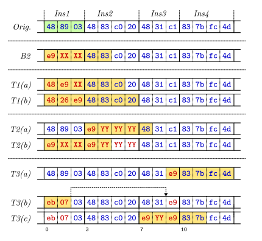

# Week 3

## Day15: 阅读模糊测试资料和掌握Radare2用法

> 传送门: [The Fuzzing Book](https://www.fuzzingbook.org/), [A journey into Radare 2](https://www.megabeets.net/a-journey-into-radare-2-part-1/#Getting_radare2)

- [x] [Fuzzing: Breaking Things with Random Inputs](https://www.fuzzingbook.org/html/Fuzzer.html#Fuzzing:-Breaking-Things-with%C2%A0Random%C2%A0Inputs): 讲述了简单的随机数生成Fuzzer及其构造, 并通过简单的代码示例介绍了比如内存溢出, 信息泄露的问题, 还有一些内存检查ASAN和assert来帮助检查错误的方法.
- [x] Radare2
  * 一些常用的选项:
    * -a arch 指定架构
    * -A 运行aaa命令用以进行完整的分析
    * -b bits 指定比特数
    * -B baddr 指定载入基地址
    * -c cmd 指定要执行的radare命令
    * -d 进入调试模式
    * -i file 运行指定的脚本
    * -k os 指定os (linux, macos, w32, netbsd, ...)
    * -l lib 载入插件
    * -p project 使用指定工程
    * -w 以write模式打开文件
  - [x] rabin2: 可以从二进制中提取`Sections, Headers, Imports, Strings, Entrypoints`信息, 支持多种文件格式`ELF, PE, Mach-O, Java CLASS`
    * `rabin2 -I file`: 显示二进制的基本信息
  * radare2命令:
    * `ie`: 显示程序入口点信息(info entrypoint)
    * `fs`: 显示可用的标记, `fs symbols; f`可以打印相应标记空间里的信息
    * `iz`: 显示data段里的字符串, `izz`可以打印整个二进制内的字符串
    * `axt`: 找到引用该地址的地方, `axf`则是找到该地址引用的目的地址. 注意现在需要指定`fs`进行搜索了. `fs strings; axt @@ str.*` 
    * `@@`: 可以理解为for-each
    * `afl`: analyze function list, 显示分析处的函数列表
    * `s`: seek, 可以进入到相应的函数或地址, 函数名可以用上面的`afl`给出
    * `pdf`: print diasm function, 显示函数的汇编指令
      * `pdf @ sym.beet`可以用于显示指定函数的汇编
    * `V`: 进入Visual Mode, 使用`p/P`切换模式,
    * `Visual Mode`下的操作:
      * `k`和`j`: 跟vim一样进行上下移动
      * `Enter`: 在jump和call指令的时候, 可以用于进入到目的地址
      * `u`: 返回上一个地址
      * `x/X`: 显示交叉引用, x表示到达该指令的引用, X表示该指令所引用的地方
      * `: command`用来执行shell命令
      * `;[-]comment`: 用来增加/移除注释
      * `m<key>`: 用来标记某个具体的偏移并用某个按键来绑定
      * `q`: 退出visual mode
    * `VV`: 进入`Visual Graph`模式, 就是直接看控制流图
    * `Visual Graph`下的操作:
      * `hjkl`进行移动
      * `g`进入函数, 在graph里很多函数后面都有一个按键的标记, 按下就能进入该函数
    * `ahi`: 用于做数据的类型转换, 比如将某个地址的数据转换成字符串类型`ahi s @ <addr>`
    * `ood`: 重新以Debugger模式打开文件, 可以带参数, 比如`ood args1`
    * `dc`: debug模式下执行, 类似`continue`命令, 会继续执行

## Day16: 了解代码覆盖率和程序分析研究进展

- [x] [Code Coverage](https://www.fuzzingbook.org/html/Coverage.html)
  * 黑盒测试用于测试特定条件的结果. 优势是能够针对特定输入检查错误, 劣势是无法达到很好的覆盖率. 
  * 白盒测试则会尽量满足覆盖率, 起码满足语句和分支的覆盖. 优势是能针对已实现的行为进行测试, 而劣势就是无法满足未能实现的行为. 
  * py通过trace的方式将执行的代码行信息汇总起来得到覆盖率. 而c代码可以通过gcov获取覆盖率情况
- [x] [程序分析研究进展](http://kns.cnki.net/kcms/detail/detail.aspx?filename=RJXB201901006&dbcode=CJFQ&dbname=CJFDTEMP&v=)
  * 抽象解释: 通过对程序语义进行不同程度的抽象以在分析精度和计算效率之间取得权衡. 
  * 数据流分析: 通过分析程序状态信息在控制流图的传播来计算每个静态程序点(语句)在运行时可能出现的状态
    * IFDS/IDE 数据流分析框架: IFDS将数据流分析问题转换为图可达问题, 从而有效进行上下文敏感的过程间分析. 
      * IFDS基于程序过程检控制流图定义了一个超级流图, 其中每个节点对应在一个程序点的抽象域中的一个元素, 而节点间的边表示该元素在过程间控制流图的传播, 对应着数据流分析中的转移函数. 
      * 通过求解是否存在从程序入口到每个程序点的可达路径, 我们可以得到该程序点的状态信息.
    * 基于值流图的稀疏数据流分析方法
      * 传统数据流分析在cfg上将所需计算的状态信息在每个程序点传播得到最终分析结果, 这个过程中通常存在较多冗余操作. 为了提高效率, 提出了多种稀疏的分析方法从而不需计算状态信息在每个程序点的传播而得到和数据流分析相同的结果. 
      * 该技术通过一个稀疏的值流图直接表示程序变量的依赖关系, 从而使得状态信息可以有效地在该稀疏的值流图上传播. 值流图保证了状态信息有效传播到其需要使用该信息的程序点, 并避免了无效程序点的冗余传播, 可大幅提高效率. 
  * 移动应用软件
    * 污点分析: 动态污点分析TaintDroid通过修改的Dalvik虚拟机, 在应用的java字节码解释执行过程中进行动态插装以实现对敏感数据的跟踪分析
  * 二进制代码
    * 递归遍历反汇编: 无法准确识别间接跳转指令的跳转目标
      * 提出基于程序切片技术将间接跳转表进行规范化表示, 根据启发式特征识别间接跳转语句的目标
      * 提出通过在CFG上进行数据流分析, 进而完善CFG, 再迭代式进行数据流分析, 逐步完善CFG. 
      * 提出通过动态分析识别间接跳转的目标, 并采用强制执行的方式驱动程序探索所有路径, 从而构建相对完整的控制流图. 
      * 提出通过RNN识别二进制程序中的函数便捷
    * 高级语义恢复: 二进制程序大量信息确实. 
      * 提出采用NLP类似技术识别二进制程序汇总的函数特征(参数类型和个数)
      * 提出通过切片, 提取函数调用指令的操作数的规范化表示, 根据启发式特征识别虚函数调用点
      * 提出识别程序中静态已知的全局地址, 栈偏移等识别全局变量和栈变量, 通过数据流分析识别间接内存读操作的返回结果等. 实现对二进制程序中的内存访问操作语义的识别. 
      * 提出通过数据流分析, 跟踪this指针的流向, 识别候选的类成员函数及变量, 从而恢复c++对象
    * 代码插装/改写
      * 在原始二进制程序中静态修改: 挑战是反汇编的准确率, 不正确的反汇编会使得插装后程序执行异常
      * 将二进制程序提升到IR再修改: 插装在IR上完成, 与二进制的指令集无关
      * 在代码执行过程中动态修改: 通过受控的执行环境, 在目标基本块, 函数执行前进行插装
    * 匹配漏洞模式
      * 静态分析组件间调用关系, 与恶意代码特征进行匹配, 从而识别安卓恶意代码
  * 面向智能合约的程序分析
    * 符号执行被用于字节码层面检测智能合约中的已知类型的潜在漏洞
    * 相比传统软件, 智能合约的体量较小, 使得对其使用形式化技术称为可能. 
    * 有的工作甚至直接将智能合约代码转换已有的验证系统所支持的形式, 借助已有验证系统快速形成分析, 比如将智能合约代码转换为LLVM字节码
  * 面向深度学习软件的程序分析
    * 由于广泛存在的概率模型, 多层传播的复杂网络结构, 黑盒形式的用户借口等特性, 深度学习工具的质量难以度量, 现有的软件分析技术难以直接应用.
    * 提出了面向深度学习的动态符号执行方法, 该方法将测试需求表示为量化线性运算, 以神经元覆盖为目标测试深度神经网络的鲁棒性. 


## Day17: 了解基于变异的模糊测试技术和Python的代码简洁之道

- [x] [Mutation-Based Fuzzing](https://www.fuzzingbook.org/html/MutationFuzzer.html)
  * 基于变异的模糊测试: 通过微小的变异, 使得输入能够有效地触发新的行为
  * 完全的随机生成有效输入需要的运行次数极其巨大, 因此思路转变为从有效输入中进行变异获取输入
  * 每次变异都是微小的改动, 比如插入一个字符, 删除一个字符, 翻转比特等等
  * 我们需要去引导有价值的变异, 抛弃无效的变异, 所以这里引入覆盖率作为模糊测试的指标进行判断哪个变异更好

- [x] [clean-code-python](https://github.com/zedr/clean-code-python): 
  * 使用有意义且可发音的变量名. 
  * 对于同一个类型的变量尽量统一使用相同的词汇来描述: 主要是避免多种说法带来的不一致和混淆, 增加维护的成本. 如有必要, 还可以进一步封装成类通过getter和setter使用
  * 尽量不要使用硬编码: 或者类似魔数, 因为这样的硬编码数据很难进行管理, 并且也失去了它的表征含义. 
  * 尽可能多的使用带有信息的变量, 少用索引表示. 因为索引很难体现出它的涵义, 如有可能尽量用字符串索引.
  * 减少不必要的上下文信息: 在我已经知道这是个什么东西的时候, 它的属性或成员就没有必要再重复这个信息. 不用犹豫直接把它去掉, 不要带来信息的冗余. 
  * 使用默认参数(缺省值)来替代短路或条件. 
  * 尽量减少函数的参数个数, 2个或更少为宜, 如果超出了, 那么可以考虑将函数代码进行拆分. 
    * 使用`from typing import NamedTuple`和`from dataclasses import astuple, dataclass`在类构造的时候非常优雅!
  * 一个函数, 一个功能: 尽量保持一个函数只实现一个功能, 这样能方便维护和重构
  * 使用生成器能让代码在简洁的同时减少内存占用
  * 不要将标志(flags)/模式(mode)作为函数参数: 将其作为函数参数说明你在该函数内实现了多个功能, 请保持一个函数一个功能的原则, 将其拆分开来. 
  * `SRP: Single Responsibility Principle`: 单一职责原则. 将不同的职责分离到单独的类中, 当需求变化时, 这个变化可以通过更改职责相关的类来实现. 如果一个类拥有多于一个的职责, 这些职责就耦合在了一起, 那么就会有多于一个原因来导致这个类的变化. 对于某一职责的更改可能会损害类满足其他耦合职责的能力, 这样的耦合会导致设计的脆弱, 以致于职责发生改动时产生无法预期的变化. 
  * `OCP: Open/Closed Principle`: 开闭原则. 一个软件实体如类, 模块和函数应该对扩展开放, 对修改关闭. 当修改需求时, 应该尽量通过扩展来实现变化, 而不是通过修改已有代码来实现变化. 
  * `LSP: Liskov Substitution Principle`: 里氏替换原则. 任何父类可以出现的地方, 子类一定可以出现.  
  * `ISP: Interface Segregation Principe`: 接口隔离原则: 使用多个隔离的接口, 优于使用单个接口, 这可以降低类之间的耦合度
  * `DIP: Dependence Inversion Principle`: 依赖倒转原则: 高层模块不应依赖低层模块, 两者都应该依赖其抽象, 抽象不应该依赖细节, 细节应该依赖抽象. 

## Day18: 了解灰盒模糊测试技术和阅读二进制重写的论文

- [x] [Greybox Fuzzing](https://www.fuzzingbook.org/html/GreyboxFuzzer.html):
  * AFL通过轻量级的插装来获取输入的分支覆盖情况. 如果某个输入提高了覆盖率, 那么就将它扔回种子池做更多变异. 
  * AFL的插装是通过在每一个跳转指令处插入一小段代码, 执行时会为执行的分支分配一个唯一的标识符, 并递增该分支的计数器. 出于性能考虑值统计粗略的分支名字次数. 
  * 插装在程序编译阶段完成, 同样对于无法插装的代码(黑盒)也能通过QEMU或Intel Pin来运行AFL
  * `Power Schedules`: 能量调度. 用于为有趣的种子分配更多的能量. 
- [x] [Binary Rewriting without Control Flow Recovery](https://www.comp.nus.edu.sg/~abhik/pdf/PLDI20.pdf)
  * 二进制重写需要恢复控制流主要是因为可能会移动指令, 所以需要控制流信息. 
  * 论文提出了`E9Patch`, 它可以在不需要移动指令的情况下将跳转指令插入到函数蹦床(trampoline)去, 实现了在无需控制流信息的情况下静态重写x86_64的二进制文件. 
  * 传统二进制重写工具的步骤: 
    1. 使用一个反汇编器前端解析二进制文件的机器码指令. 
    2. 恢复控制流信息.
    3. 对插入/删除/替换/重定位后的二进制代码进行转换
    4. 输出修改后二进制的后端. 
  * 实际情况下二进制很难恢复控制流信息, 传统方法仅能针对小且简单的文件 
  * `instruction punning`(指令修补): 一种轻量级的动态插装方法. 
  * 现有的x86_64补丁技术
    1. `Signal Handlers`: 用单字节`int3`指令替换每个patch处的指令. `int3`会触发中断, 信号处理程序接受到该中断进行patch. 但是中断需要内核/用户模式的上下文切换, 性能极差. 
    2. `Jumps`: 用跳转指令代替patch位置的指令, 跳转指令会跳向实现该patch的蹦床. 蹦床执行完转回主程序, 这种方法比中断要快很多. 在x86_64上可以使用`jumpq rel32`来实现, 该指令长度为`5`, `1`个字节是跳转指令的操作码, `4`个字节则是`rel32`. 因此patch位置的指令大于等于`5`个字节时就可以之间进行替换. 而小于`5`个字节的时候就难以适用.
    3. `Instruction Punning`: 找到一个与任何重叠指令共享相同字节表示形式的相对偏移值`rel32`, 然后用此特殊的`rel32`值将补丁指令安全地替换为相对近跳转. 
       * 例如:  `mov %rax,(%rbx) add $32,%rax`
       * original: 48 89 03 48 83 c0 20
       * patched:  e9 xx xx 48 83 c0 20
       * 假设我们需要修补的是这个`3`字节长的`mov`指令. 我们就可以修改前3个字节, 同时利用重叠的`48 83`进行跳转, 也就是`jmpq 0x8348xxxx`, 这样我们就实现了修改3个字节的同时的得到了5字节的跳转指令. 
       * 同样蹦床的位置(`rel32`)也就被限制在了`0x8348xxxx`的范围. 同时`0x8348xxxx`也不一定是有效的地址范围, 如果指向了无效的地址范围, 那么就不能用作蹦床位置. 因此这也就是该技术遇到的关键问题. 
    * 论文的方法: 结合`Jumps`和`Instruction Punning`方法, 如果这两个方法都失败了, 那么就根据策略T1/T2/T3组合进行指令的`padding/punning/eviction`(填充/修改/逐出). 
  * Patch策略:
    * 基于以下指令序列进行解释
    
      ```
      Ins1: mov %rax,(%rbx)  
      Ins2: add $32,%rax 
      Ins3: xor %rax,%rcx
      Ins4: cmpl $77,-4(%rbx)
      ```

    * 
    * T1(Padded Jumps): 使用冗余的指令前缀来填充跳转指令. 如图所示, T1(a)的冗余前缀是`48`, T2(a)的冗余前缀是`48 26`. 使用冗余前缀的缺点就是会限制可操控的范围, 比如B2的范围是`0x8348xxxx`, 但T1(a)的范围只有`0xc08348xx`, T1(b)则是一个具体的值了. 
      
      * T1的适用性取决于补丁指令的长度, 长度越大, 能右移尝试的次数也就越多. 同时也意味着T1不适用于`单字节指令`. 同时右移会受到越多的范围约束. 
    * T2(Successor Eviction): 使用后一个指令(ins2)的pacth冗余来填充跳转指令(ins1). 比如利用T1策略将`ins2`填充为`e9 YY YY YY`, 那么可以再次应用T1策略让`ins1`利用`ins2`的冗余`e9 YY`, 那么可以控制的范围就成了`0xYYe9XXXX`. 而这个策略不仅能提高覆盖的范围, 也能适用于单字节指令(直接覆盖为e9)
    * T3(Neighbour Eviction): 通过短跳转(-128~127)来跳转到附近的可用指令, 到达后结合T1和T2使用得到更大的覆盖范围. 
  * `Reserve Order Patching`: 按照反向顺序修补指令, 比如先补丁Ins2指令, 然后补丁Ins1指令. 


## Day19: 对Python代码进行数据流前向切片

- [x] [romanofski/programslice](https://github.com/romanofski/programslice)
  * 仅实现了前向切片
  * 程序的切片函数入口是`slice_string`. 它接受5个参数, 前3个是用于指定你要跟踪数据流的变量名以及该变量所在位置(行和偏移). 然后给定程序代码片段. 

    ``` python
    node = ast.parse(source, filename)
    visitor = programslice.visitor.LineDependencyVisitor()
    visitor.visit(node)
    graph = visitor.graph
    if graph:
        start = programslice.graph.Edge(varname, currentline, offset)
        result = programslice.graph.Slice(graph)(start)
    return formatter(result, source)()
    ```

  * 分析和遍历是借助模块`ast`来实现的. 通过继承`ast.NodeVisitor`实现`LineDependencyVisitor`类, 并重写了`visit_FunctionDef`和`visit_Name`方法. 
    * 重写`visit_FunctionDef`只是单纯清空了保存的`writes`和`reads`字典. 这是避免函数之间的结果冲突. (也就是还不支持跨函数的分析)
    * `visit_Name`则是关联的重要步骤. 因为通过`ast`我们可以遍历语法树里的节点, 对于数据流分析, 如果仅仅是关注某个变量的数据流向, 那么只需要关注`read`和`write`. 同时表现也就是`ast.Load`和`ast.Store`. 那么在遍历到这样的情况后, 就可以进行关联.
  * 关联后得到`graph`. 然后根据给定的起始变量`varname`和它所在行和偏移, 进行前向切片得到`result`
  * 因为边的关联都在`graph`里关联好了, 所以在指定好变量后, 前向切片也不过是从指定的边开始, 匹配所有相关的边而已. 这里使用了深度优先的方法进行遍历. 

    ``` python
    visited = [edge]
    children = deque(self.graph.get(edge))
    if not children:
        return []

    while children:
        edge = children.popleft()
        if isinstance(edge, Graph) and edge not in visited:
            slice = Slice(edge)
            visited.extend(slice(edge.first))
        elif edge not in visited:
            children.extend(deque(self.graph.get(edge)))
            visited.append(edge)

    return visited
    ```

## Day20: 详细阅读并总结e9patch的论文内容

> 项目地址: [e9patch](https://github.com/GJDuck/e9patch): A Powerful Static Binary Rewriter

- [x] [论文总结的PDF](../assets/e9patch-summary.pdf)


## Day21: 阅读逆向工程参考手册和阅读IDA插件源码

- [x] [reverse-engineering-reference-manual](https://github.com/yellowbyte/reverse-engineering-reference-manual)
  * 内存中的值存储是小端序, 但是移入寄存器时就是大端序. 
  * 调试寄存器(DR0-7): DR0-3用于存储硬件断点信息, DR4-5保留, DR6是状态寄存器, 其中包含发生调试时间的信息, DR7存储DR0-3的断点条件和长度.
  * CPU尝试执行指令前会检查当前是否触发硬件断点, 如果该地址存储在DR0-3中, 且满足读/写/执行条件, 就会触发`INT1`并暂停进程
  * IDA会显示程序的`本地函数`, `静态链接函数`和`动态链接函数`
  * IDA函数窗口的的一些字段信息: 
    * sagment: 该函数所属的段
    * locals: 局部变量和保存的寄存器长度(字节)
    * arguments: 该函数的参数长度(字节)
    * R: 该函数会返回给调用它的函数
    * F: far function
    * L: 库函数
    * S: 静态函数
    * B: BP based frame. IDA会自动将所有的栈帧指针转变为栈变量
    * T: 该函数包含类型信息
    * =: 栈帧指针是最初的栈指针. 也就是指向栈帧底部.
  * GDB的设置: `set disable-randomization off`和`set disassembly-flavor intel`
  * `apropos <arg>`可以搜索gdb里有关`arg`的命令/文档
  * Microsoft Visual C++编译的程序, this指针保存在ecx, 有时保存在esi, g++编译的程序, this作为函数第一个参数传入.
- [x] [findcrypt-yara](https://github.com/polymorf/findcrypt-yara): 实际上YARA规则来自于另一个开源项目[Yara-Rules](https://github.com/Yara-Rules/rules)里的crypto规则. 插件只是进行了yara匹配把结果显示出来. 
- [x] [ida_yara](https://github.com/alexander-hanel/ida_yara): 利用了yara, 需要手动提供要匹配的字符串或十六进制值, 或者也可以正则, 作者用来搜索IDB里的数据, 但是没有很好的规则只能手动写匹配的话, 适用性有点差. 还不如不要做成IDA插件, 单独利用yara写一个脚本来做通用性的更好些. 
- [x] [ALLirt](https://github.com/push0ebp/ALLirt): libc转换为FLIRT特征是通过flair工具来实现的, 主要是`pelf`和`sigmake`. 另外有一个py库`patoolib`支持多种格式文件的解压还蛮不错. 
  * 创建.pat文件: `./pelf -p64 /usr/lib/x86_64-linux-gnu/libc.a libc.pat`
  * 创建.sig文件: `./sigmake -n <libname> libc.pat libc.sig`
- [x] [IDAFuzzy](https://github.com/Ga-ryo/IDAFuzzy): IDA的模糊搜索插件. 模糊搜索功能由[fuzzywuzzy](https://github.com/seatgeek/fuzzywuzzy)库实现, 这个库的使用也很简单, 可以进行字符串之间的模糊匹配评分, 也可以根据一个字符串从一堆字符串中选出相似的结果.