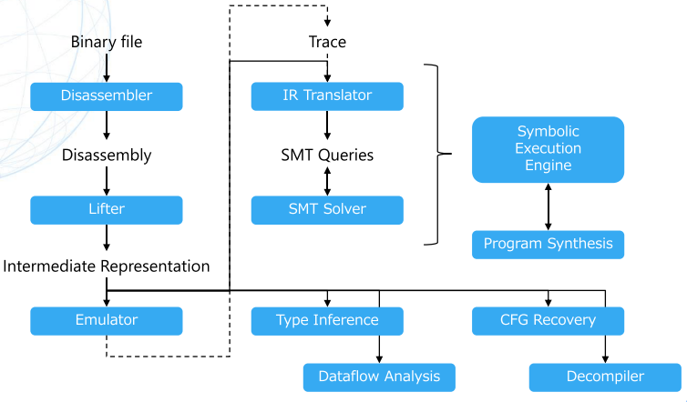
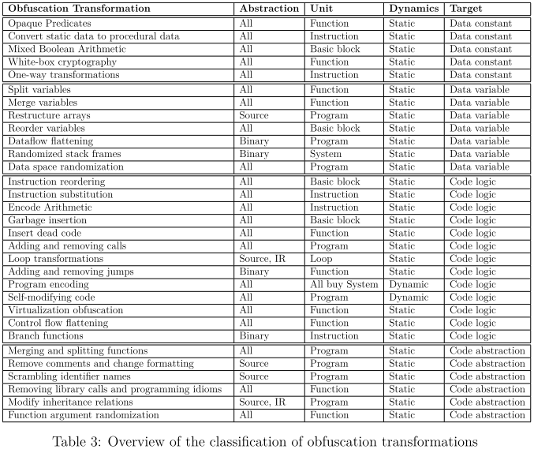
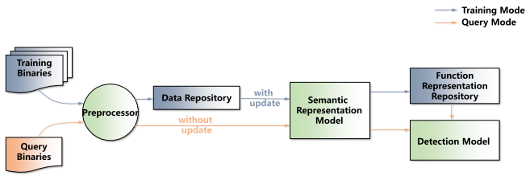
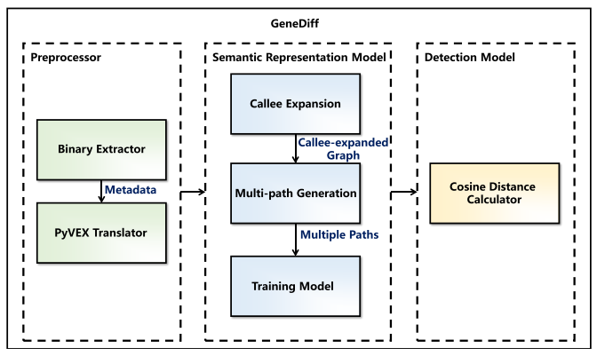
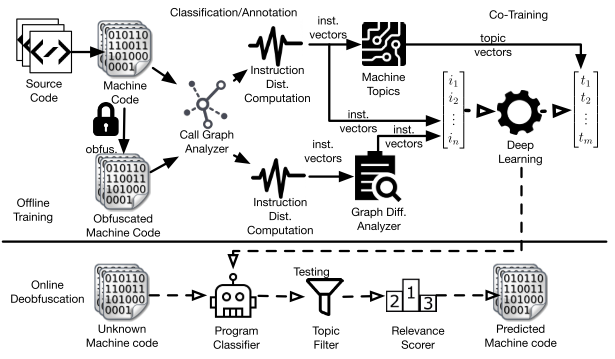

# Week 4

## Day22: 学习熊英飞老师的软件分析技术课程

> 熊老师的Software Analysis课程主页: [传送门](https://xiongyingfei.github.io/SA/2019/main.htm#info)

- [x] [课程介绍](https://xiongyingfei.github.io/SA/2019/01_intro.pdf):
  * 哥德尔不完备定理: 对任意能表示自然数的系统, 一定有定理不能被证明
  * 主流程序语言的语法+语义 = 能表示自然数的形式系统
  * 停机问题, 内存泄露判定问题, 实质上也是不可判定问题, 也就是不能针对该问题的每一个实例都给出是/否的答案, 也就是说, 计算机没有能力去完全判断一段代码的好坏. 
  * 莱斯定理: 将程序视作一个从输入到输出的函数, 关于该函数的任何`非平凡属性`, 都不存在检查该属性的通用算法. 
    * 平凡属性: 要么对全体程序都为真, 要么都为假的属性
    * 非平凡属性: 不是平凡的所有属性(可以理解为存在差异性)
  * 检查停机问题的算法:
    * 当前系统的状态为内存和寄存器中所有bit的值
    * 给定任意状态, 系统的下一状态是确定的
    * 令系统所有可能的状态为节点, 状态之间的转换作为有向边. 形成一个有向图(有限状态自动机)
    * 如果`从任意初始状态出发的路径都无环`, 那么系统一定停机, 否则可能死机.
    * 因为状态数量有穷, 所以该算法一定终止. 
  * 近似求解判定, 除开回答"是"和"否", 还可以表示一个模糊的判断"不知道". 
    * 上近似: 只输出"否"和"不知道", 因为这里作为下的"否"是精确的, 所以是上近似
    * 下近似: 只输出"是"和"不知道", 同样, 这里作为上的"是"是精确的, 所以是下近似
    * 好的结果当然是尽量回答精确的"是"和"否", 少回答模糊的"不知道"
  * 假设正确答案是集合S:
    * must分析: 返回集合总是S的子集
    * may分析: 返回集合总是S的超集
    * 更全面的分析: 返回S的子集(must), 超集(may), 不相交集(never)
  * 求近似解的另一种方法`搜索`(上一个方法是`抽象`): 穷举所有的组合来回答是或否, 如果超时则认为"不知道"
  * 基于抽象解释的程序分析: `数据流分析`, `过程间分析`, `指针分析`, `抽象解释`, `抽象解释的自动化`.
  * 基于约束求解的程序分析: `SAT`, `SMT`, `霍尔逻辑`, `符号执行`
  * 参考资料: `龙书`, `Lecture notes on static analysis`, `https://cs.au.dk/~amoeller/spa/`, `Principle of Program Analysis`, `Decision Procedures An Algorithmic Point of View`

## Day23: 学习高级二进制代码反混淆资料

- [x] [Advanced Binary Deobfuscation](https://github.com/malrev/ABD):
  * 定义: 混淆就是将程序P转换成更难提取信息的程序P'
  * 混淆的阶段: 
    1. 编译器前端词法分析前的`preprocessor macro source code analysis`阶段进行. 这里我理解为混淆变量名这种的技术
    2. 后端优化时的`inline assembly obfuscation pass`进行. 这里我理解为代码膨胀插入花指令的阶段. 
    3. 后端生成代码后的`packing binary rewriting`阶段进行. 这里我理解为加壳
  * 从`A Tutorial on Software Obfuscation`里可以得知有分为31种已知混淆技术. 
  * 混淆工具: 商业有`Themida`, `Code Virtualizer`, `VMProtect`, `Enigma`, `Epona`等. 学术界有`Tigress`和`O-LLVM`. 
  * 恶意软件会在早期的传播过程中使用混淆, 例如`macro/script/dropper/downloader/beacon`. 在后阶段的`implant/agent/rookit`使用混淆. 
  * 混淆技术的通用手法:
    * 做无用功: 插入垃圾指令或dead code. 用于遮掩和干扰
    * 改变语法: 替换等价指令, 编码文本和算术操作
    * 改变语义: `Opaque Predicate`混沌不透明谓词? 控制流平坦化, 代码虚拟化
  * 混淆技术:
    - [x] Garbage/Dead Code Insertion: 插入不会影响预期结果的指令, 通常会结合其他混淆技术
    - [x] Instruction Substitution: 将指令替换成等价的, 更复杂的指令
    - [x] Encode Literals: 将文本信息(常量, 字符串等))替换成更复杂的表达. 比如将"helloworld"拆分成单个字母串起来. 
    - [x] Encode Arithmetic/Mixed Boolean Arithmetic: 将算术操作/布尔逻辑替换成更复杂的表达. 比如a+b, 转换成a-(-b)
    - [x] Opaque Predicate: 对于没有分支的地方, 加一个永远也不会触发的分支. 可以通过插入一个确定性的操作实现. 比如说`cmp eax, 0xfffffff`, 强行增加一个分支出来. (或者利用其他的恒等式/恒不等式)
    - [x] Virtualization Obfuscation: 将代码替换为虚拟机的字节码, 由虚拟机解释执行. 
    - [x] Control Flow Flattening: 利用switch语句, 让平坦化的每一个基本块都有一个索引, 根据索引跳到下一个基本块, 执行基本块时更新索引, 这样就能使得跳到switch同级的不同基本块去.
  * 解混淆技术:
    * 途径: 
      * 简化: 将代码转换成可读的形式
      * 消除: 移除冗余代码
      * 动态分析: 避免直接阅读混淆代码
    * 技术栈: `数据流分析`, `符号执行`, `等价性检查`, `抽象解释`, `程序生成`, `污点分析`
  * 解混淆针对混淆技术各个阶段的策略:
    * 做无用功 <- 数据流分析(存活性分析)
    * 改变语法 <- 数据流分析(可达性分析)
    * 改变语义 <- 符号执行, 等价性检查, VMHunt, 程序生成, 图特征匹配.
  * 程序分析的工具: IDA, radare2, Binary Ninja, angr, BINSEC, Triton, Miasm, McSema等
  * 程序分析前后端:

  

  * 中间表示(IR): 
    * IR的目的是为了方便进行二进制代码的分析
    * IR能帮助处理多种架构的代码(平台无关).
    * IR通常是SSA格式: 每个变量仅分配一次, 在使用前定义. 这个属性能帮助优化和转换. (能帮助消除歧义)
    * IR也有难以建模的地方, 因此不能完全等价于原来的代码, 只能做到近似. 
  - [x] 数据流分析(我要回去看下南大李老师的视频解说)
    - [x] 可达性分析:
      * 前向数据流分析
      * 分析程序到达某个点P时, 变量x的值于何处被定义
      * 应用: `Constant propagation/folding`, `Transform expressions`
    - [x] 存活性分析
      * 后向数据流分析
      * 分析从p起始的边到x时, 在p点x的值是否可用. 
      * 应用: 消除死代码
    - [x] 限制
      * 保守方法: 保留了程序语义, 假定传递程序的整个路径
      * 流敏感, 路径不敏感: 会注重指令的顺序, 不注重条件分支
      * 如何干扰数据流分析? 
        * 插入不透明谓词
        * 因为数据流分析不关注哪条路径被实际执行了,

## Day24: 阅读混淆技术论文综述部分内容

- [x] [A Tutorial on Software Obfuscation](https://mediatum.ub.tum.de/doc/1367533/file.pdf)
  * 混淆工具输入程序输出功能等效但是更难理解和分析的另一个程序. 一些经典的编译器优化选项也被认为是混淆的一种, 因为它为了使代码更高效而将开发人员易于理解的代码替换成其他代码. 
  - [x] Classification of Code Obfuscation Transformations:
    - [x] Abstraction Level of Transformations:
      * 常用的分类维度就是混淆转换所发生/抽象的级别, 比如源代码层, 中间表示层, 二进制机器代码级别. 
      * 这样的分类的目的在于可用性, 比如JS跟关心源代码混淆, 而C跟关心二进制级别混淆. 
      * 存在某些混淆转换能对多个抽象级别都产生影响
    - [x] Unit of Transformations:
      * 考虑混淆转换的粒度, 有以下几种:
        * 指令级: 应用于单个指令或指令序列. 
        * 基本块
        * 循环结构: 替换掉开发者熟悉的循环结构
        * 函数级: 影响函数的特定指令和基本块, 此外还可能影响函数对应的堆和栈
        * 系统级: 针对操作系统或运行时环境. 影响程序与之交互的方式.
      * 开发者可以根据他们要保护的资产来选择相应的粒度, 比如循环级别转换不适用于隐藏数据, 但适合隐藏算法.
    - [x] Dynamics of Transformations:
      * 将混淆转换静态/动态地应用于程序或其数据上, 静态转换发生在`实现/编译/连接/安装/更新`的过程, 也即程序及其数据并不会在执行时发送变化. 但程序或其数据可以在`加载/执行`期间发生变化, 比如程序可以在加载时进行解码
    - [x] Target of Transformations
      * 分类的零一常见维度就是转换的目标. 最初可分为: `布局/数据/控制/预防`性转换, 但后面也有人提出其他的分类: `抽象/数据/控制/动态`转换. 因此我们可以大致分为以下两类:
        * 数据转换: 修改程序中硬编码的常量值(比如数字/字符串/键等)的`表示形式和位置`, 以及变量的`内存值`
        * 代码转换: 转换`高级抽象`形式(比如数据结构, 变量名, 缩进等)以及`算法`和`控制流. 
  - [x] Classification of MATE Attacks
    - [x] Attack Type Dimension
      * 根据Collberg的理论, 攻击者对以下四种信息的恢复感兴趣:
        * 源代码的原始或简化版本: 知识产权盗窃
        * 静态嵌入或动态生成的数据: 比如解密密钥, 硬编码的密码, IP地址等
        * 用于混淆的转换序列或混淆工具(元数据): 杀毒引擎可以根据这些数据检测可疑文件
        * 特定功能代码的位置: 攻击者可以复用这块功能代码而不必了解其实现方式(比如解密数据模块)
      * 将攻击类型分为三类: 1. 代码理解 2. 数据项恢复 3. 位置信息恢复
    - [x] Dynamics Dimension
      * 动态分析会运行程序, 并在执行过程中记录已执行的指令, 函数调用以及内存状态
      * 与静态分析相反, 动态分析通常时不完整的, 即它不能探索和推理程序的所有可能的执行状态.
    - [x] Interpretation Dimension
      * 指是将程序代码或者由代码而来的分析结果(比如静态反汇编, 动态跟踪指令序列)视为文本还是根据其语义(操作的语义)进行解释. 
      * 语法攻击: 将源代码或分析结果视为一串字符串, 比如通过模式进行匹配, 或将代码视作字符串序列扔给机器学习进行模式识别.
      * 语义攻击: 根据某些语义来解释代码(如指称语义, 操作语义等), 比如`抽象解释`使用`指称语义`, `模糊测试`使用`操作语义`
    - [x] Alteration Dimension
      * 是指自动化攻击是否会修改代码. 
      * 被动攻击: 不会对程序代码或数据进行任何更改, 比如从程序中提取密钥和密码不会更改任何代码
      * 主动攻击: 会更改程序的代码或数据, 例如删除数据/代码的完整性检查相关代码. 

## Day25: 了解各类混淆转换技术以及对应对抗方法

- [x] [A Tutorial on Software Obfuscation](https://mediatum.ub.tum.de/doc/1367533/file.pdf)
  - [x] Constant Data Transformations
    - [x] Opaque predicates
      * 不透明谓词其实就是一个结果固定不变的表达式, 但攻击者很难静态推断这个结果. 
      * 可以通过在循环条件中添加不透明谓词, 虽然不会影响循环条件, 但是会让攻击者更难理解循环何时终止.
      * 可以通过难以静态求解的数学公式来创建不透明谓词, 也可以用其他难以静态计算的问题, 比如`别名`来构建.
      * 别名的状态是难以确定的, 比如就是`指针别名分析`问题, 难以确定在给定的执行点中, 哪些符号是某个具体内存位置的别名. 
      * 因此可以利用别名的不确定性来构建`链表`作为不透明谓词: 通过构造链表操作, 对于混淆器而言, 它是知道链表指针指向的值`*q1 > *q2`的, 但是对于攻击者静态分析而言, 难以去分析链表操作去得知这个结果. 
      * 一些研究提出的对不透明谓词的对抗方法: `基于抽象解释的位置和数据恢复`, `基于符号指向的数据恢复和代码理解策略`, `通过识别已知的不透明谓词来理解和识别其他程序`
    - [x] Convert static data to procedural data (a.k.a. Encode Literals)
      * 混淆硬编码常量的简单方法就是将其转换为`运行时生成常量的函数(过程)`, 这也就意味着这个函数(过程)是可逆的. 
      * 但是编译器优化过程可能会将这些过程解开恢复为原始的值, 因此我们可以通过`不透明表达式`来做替换.
      * `不透明表达式`跟`不透明谓词`类似, 只是`不透明谓词`的结果是一个`布尔值`, 而`不透明表达式`的结果是`非布尔值`. `不透明表达式`通过依赖外部数据来构造值, 其在程序执行期间的值是固定的, 比如`cos2(x) + sin2(x) === 1`, 而这样也能避免编译器优化将其摊解开. 也可以做到`"A"+"B"+"C" = "ABC"`这样的将单字节拼接成字符串的方法. 
      * 对抗方法: `两次语义攻击`, `基于符号执行和模式识别的攻击`(也可以对抗不透明谓词)
    - [x] Mixed Boolean-Arithmetic
      * 简单来说, 就是通过`1+(2*3)+4-5-6`的结果恒定为`0`这样的手法来隐藏固定值`0`, 只是作者使用了`布尔表达式`来完成这样的运算(因为简单的算术运算肯定会被编译器优化掉). 通过这样的混合布尔运算来动态地计算硬编码的原始值. 
      * 对抗方法: 提出了Arybo的静态分析工具, 能简化MBA表达式, 该攻击旨在了解代码和恢复数据, 并使用代码语义来实现此目标. 
    - [x] White-box cryptography
      * 白盒加密的目标: 无需硬件密钥或可信实体, 而是在软件中安全地存储密钥.
      * 白盒密码技术并非是将密钥与加密逻辑分开存储, 而是将密钥嵌入密码逻辑内部. 比如AES可以将密钥嵌入T-box中, 然后再每个加密回合中与T-box相乘, 但这样容易遭受`密钥提取攻击`. 因此`WB-AES`使用更复杂的技术来防止`密钥提取攻击`, 比如`宽线性编码`, `对密码方程式做扰动`和`对偶密码`
    - [x] One-way transformations
      * 通俗的来说, 就是对于一些无需在运行时计算, 只需要判断是否相等的情况下, 可以用单向转换的方式来验证. 比如验证密码, 可以先将正确的密码进行sha256哈希后, 存储到代码里. 然后用户验证的时候重新算一次sha256跟正确的密码的哈希值进行比较, 就可以知道用户输入是否正确. 这样的单向转换就迫使攻击者必须猜测正确的密码才能完成验证, 或者去`绕过相等性检查代码`. 所以这里就需要高度保护和检查相等性代码, 以避免攻击者对其进行篡改. (比如`==`变为`!=`)
      * 对抗方法: 提出了一些方法对哈希函数进行碰撞. 
  - [x] Variable Data Transformations
    - [x] Split variables
      * 思路: 用多个变量来代替一个变量. 比如1个32bits的int变量可以分为4个8bits的byte变量表示.
      * 类似于将静态数据转换成函数/过程生成数据. 但是这里的变量可以适用于任何值而非单纯的常量. 比如你可以把所有的int都用4个bytes表示.
      * 不过由此而带来的影响就是, 所有的算术运算我们都需要`重载运算符`来完成, 因为毕竟你的数据组织格式发生变化了. 
      * 对抗方法: 提出了一种基于所谓的`temporal reuse intervals(时间重用间隔)`的动态跟踪分析技术的数据恢复攻击, 时间重用间隔能`指示内存的使用模式`, 并且也适用于对抗接下来介绍的`merge variables`方法
    - [x] Merge variables
      * 思路: 与将`split variables`不同, 它的思路是将多个变量合并为一个变量, 只要变量合并的范围在精度范围内即可(不丢失精度). 例如将4个8bits变量合并为1个32bits变量. 
      * 同样也要重载运算符, 但是这里要更加小心地去设计算术运算, 避免对无关的变量造成影响. 并且需要多合并的`所有变量`都涉及一套运算. 
      * 对抗方法: 上述的能指示内存使用模式的攻击方法, 当然人工动静态分析也是能成功逆向出来的. 
    - [x] Restructure arrays
      * 思路: 与变量类似, 数组可以拆分/合并, 除此外还能`折叠(增加维数)/展开(减少维数)`
      * 数组的`折叠/展开`会迫使攻击者了解代码逻辑才能恢复这种抽象的信息. 
      * 对抗方法: 提出了一种代码理解攻击, 该攻击基于符号执行产生的`执行轨迹`之上的`访问模式`进行模式识别, 结合了动静态技术, 以便从混淆代码中恢复数据结构. 该攻击不仅能针对数组重组, 还能针对之后介绍的`loop transformations`
    - [x] Reorder variables
      * 思路: 通过`转换或替换`变量, 来改变代码中变量的`名称或位置`. 比如将汇编代码里的`eax`寄存器更换成`edx`寄存器来做一些操作(比如临时存放变量用)但是不影响结果. 
      * 这样的转换成本比较低并且攻击者很难去识别这种模式. 这样的转换能减少ROP利用可用的gadget(研究实现原型减少了40%).
      *  对抗方法: 提出一种自动化攻击, 能够执行数据恢复, 以提取恶意软件字符长签名, 并能够破解这种对重排序变量的转换. 
    - [x] Dataflow Flattening
      * 是`Reorder variables`的改进版, 通过内存管理单元(MMU)定期对堆中存储的数据进行重新排序, 并使程序的功能不变. 
      * 实现思路:
        1. MMU为给定变量在堆上分配性的内存区域
        2. MMU将变量的值复制到新的内存区域
        3. MMU更新变量的所有指针从旧存储区指向到新存储区
        4. 最后MMU重新分配旧的内存区域(给其他变量)
      * 除了对堆上数据进行重排外, 数据流展品还建议将`所有局部变量`从栈转移到堆, 这样能加扰指针以隐藏返回给程序的不同指针的关系. 不过这种转换的执行开销也很高.
      * 对抗方法: 暂无
    - [x] Randomized stack frames
      * 思路: 为每个新分配的`栈帧`分配`栈上的随机位置`. 为此, 它会从`function prologue(函数序言, 也就是函数汇编入口处的一系列修改栈指针的指令)`中的`栈指针减去一个随机值`, 然后在`函数结语`添加回这个随机值(保持堆栈平衡).
      * 对抗方法: 提出了一种`buffer overread(不是bof)`的数据恢复攻击来绕过随机栈帧保护. 
    - [x] Data space randomization(DSR)
      * 思路: 使用随机生成的掩码(mask)对内存中的数据进行加密(比如异或xor). 掩码不需要设置为固定值, 而是可以在运行时动态生成并加密数据值. 
        1. 每当程序需要读取数据时, 首先用正确的掩码进行解密. 
        2. 在对解密数据值进行授权修改后, 根据实现方式, 使用相同/不同的掩码对结果进行重新加密. 
      * 该技术受`PointGuard`(它能对代码指针进行加密)的启发, DSR能防止从内存中提取或修改数据.
      * DSR的实现难题在于: 不同的指针可能指向`同一个加密的内存值`, 因此它们必须使用`相同的掩码`来解密数据. 我们可以用指针别名分析来部分解决问题, 但是别名分析并非完全准确, 因此只能近似的解决该问题.
      * DSR引入了平均15%的运行时开销, 并可以防止缓冲区和堆溢出攻击.
      * 对抗方法: 上述提出的`buffer overread`的攻击方法也能用于绕过DSR
  - [x] Code Logic Transformations
    - [x] Instruction reordering
      * 思路: 这次重排的目标是`指令序列`, 重排后不会改变原始程序的执行. 不过它的混淆力度并不强, 不会大大增加代码理解的难度. 
      * 重排所针对的指令序列也是并行处理优化的对象, 因为它们可以有不同的执行线程独立执行, 不会带来竞争条件的问题. 而且这种重排的成本也很低. 
      * 研究者在二进制基本块级别进行重排, 将ROP利用gadget数量减少了30%以上, 而与指令级重排相比其弹性降低的幅度也较小.
      * 对抗方法: 提出了一种静态代码理解攻击, 以检测APK恶意重打包. 该攻击使用代码语义来构建每个app的`view graph`, 将其与其他应用程序进行比较以确定它们是否是同一app的重打包版本. 研究者称该方法可以对抗多种混淆转换: `merging functions, opaque predicates, inserting dead code, removing functions, function argument randomization and converting static data to procedural.`
    - [x] Instruction substitution
      * 思路: 基于以下事实: 某些编程语言及不同给定ISA中, 存在多个(顺序)等效指令. 这意味着可以用一条等效指令替换另一条指令(序列)而不会改变程序的语义行为, 但这能导致不同的二进制表示形式. 比如swap交换变量这个操作, 可以用多个mov指令来完成, 也可以直接用push/pop来完成. 
      * 该转换的性能开销适中, 但是由于可用来转换的指令序列数量有限, 因此对抗攻击的防御力很低. 
      * 研究者在基础块级别使用了该转换, 发现其减少了不足20%的gadget数量. 此外, `使用不常见的指令`回降低防御能力, 也就是回向攻击者指示替换所发生的位置. 
      * 为了提高这种转换的隐匿能力, 研究者提出了`instruction set limitation`技术, 根据程序中指令类型的统计分布来挑选候选替换指令. 另一研究者也提出类似技术, 旨在将shellcode编码为英语文本来提高shellcode的隐匿性.
      * 对抗方法: 上述介绍到的对抗`不透明谓词`的代码理解和数据恢复攻击能应用于绕过该转换.
    - [x] Encode Arithmetic
      * 思路: 它是指令替换的一种变体. 将布尔/算术表达式用等价的另一种复杂的布尔/算术表达式做替换.
      * 同样, 能使用的布尔/算术等价表达数量有限. 
      * 对抗方法: 通过模式匹配识别混合布尔算术(MBA)表达式, 并为每个表达式编写一个逆变换.
    - [x] Garbage insertion
      * 思路: 插入任意指令序列, 这些指令序列与原始程序的`数据流无关`, 并且`不影响`其输入输出(I/O)行为(功能)
      * 实际上能插入的可能序列是无限的, 但是性能开销与插入的指令数量成比例增长.
      * 垃圾代码只能在执行编译器优化后插入, 因为可以通过污点分析识别并消除垃圾代码.
      * 对抗方法: 提出了基于污点分析的通用攻击方法, 该技术的仅受限于实际运行时约束(例如时间开销和内存开销)的限制, 因为与死代码不会执行不同, 垃圾代码总是会执行的.
    - [x] Insert dead code
      * 思路: 修改程序的控制流, 添加一个无效(决不会使用)的分支. 不透明谓词可以帮助添加无效分支. 
      * 对抗方法: 符号执行方法, 编译器领域也有许多死代码删除的优化方法
    - [x] Adding and removing function calls
      * 思路: 可以应用于任何的`转换单元`, 比如指令,IR, 基本块, 方法就是将转换单元进行`封装/解构`. 比如`c=a+b+1`就可以转变为`c = add(a,b)+1`, 反之亦然. 从效果上看就是增加函数调用的开销很啰嗦.
      * 研究者进一步扩展了该转换, 将现有的`系统调用`替换为`等效的系统调用`, 研究者将这种转换称之为`行为混淆`, 因为它隐藏了目前恶意软件行为分析引擎所需要分析的`系统调用轨迹`
      * 对抗方法: 基于机器学习的恶意软件检测方法, 因为机器学习会将函数调用轨迹视为字节序列作为输入. 
    - [x] Loop transformations 
      * 思路: 多层`嵌套/解构`循环, 能增加代码的复杂程度, 也被视作混淆的一种办法. 
      * 对抗方法: 上述介绍的针对数组重组转换的攻击方法.
    - [x] Adding and removing jumps
      * 思路: 通过`添加伪造跳转/删除已有跳转`来更改程序控制流. 可以理解为代码hook. 实践中为了增加复杂度常用的时添加跳转的方式. 
      * 该技术的转换空间受其应用程序长度的限制, 成本随着插入的指令数量而增加.
      * 可以通过使用`数据混淆技术(例如不透明表达式)`或`将静态数据转换为过程数据`来进一步`混淆跳转的目标地址`, 以增加抵御能力.
      * 对抗方法: 提出了增强CFG进行动态污点分析, 这样无需逐个移除跳转指令.
    - [x] Program encoding
      * 思路: 程序事先对多个指令进行了编码, 而在运行时动态地对指令序列节码. 
      * 抵御能力取决于编码的算法, 例如无需密钥就能进行的压缩算法, 或需要找到密钥的解密算法. 但成本可能较高, 因为在执行代码前必须对代码解码. 
      * 而且抵御能力与成本之间存在权衡, 具体取决于编码的粒度. 如果时所有指令都在执行时才解码, 那么攻击者无法通过内存dump来得到解码后的代码. 而如果以程序级进行编解码, 那么攻击者时可以等你解码完之后dump内存来获取代码的. 
      * 此外该技术无法很好地抵御动态分析, 因为执行过程中代码在内存中解码, 攻击者可以在内存中之间读取/修改代码.
      *  对抗方法: 研究者提出被动句法攻击, 以混淆后的恶意程序中字节值的位置和分布提取特征. 另一研究者提出基于污点分析的动态语义攻击, 以确定代码中的完整性检查代码的位置. 
    - [x] Self-modifying code
      * 思路: 在程序执行期间添加/修改/删除程序的指令. 因此它能给静态分析带来很大的难度.
      * 实现方法1: 用伪造指令来代替实际指令, 执行到伪造指令时, 再用实际指令替换回去执行, 实际指令执行完后, 再用伪造指令替换回去. 这种转换要求对改动指令的`所有执行路径`都进行合理的分析.
      * 实现方法2: 在函数级别上, 将函数用统一的`函数模板`做替换来实现自修改. 这要求函数模板里的数据结构要能兼容所有被替换的函数. 所有被替换的函数应用`函数模板`时会生成一个`编辑脚本`, 我们可以理解为函数的`diff`文件, 以便根据函数模板重建对应的函数.
      * 对抗方法: SMC可以有效地对抗那些会破坏代码完整性的动态分析(比如动态patch). 但研究表明, SMC会对加密密钥的机密性产生负面影响, 因为使用不同的密钥对同一代码进行加密会泄露代码的信息, 这类似于两个时间片. 因此SMC不应当保护解码函数. 研究者应用了一种基于抽象解释的攻击来为变形的恶意软件样本生成签名. 
    - [x] Virtualization obfuscation
      * 思路: 通过对指令进行编码, 并使用额外的解释引擎(称为模拟器或仿真器)来解码指令并在底层平台上运行指令. 
      * 该模拟器可以在另一个模拟器之上运行, 形成多层嵌套. 攻击者必须先了解这个定制的模拟器的解释逻辑才能继续分析. 
      * 虚拟化和程序编码的最大不同就在于, 解码期间无需将任何代码写入存储位置(解码时即运行). 但成本考量跟程序编码一样. 
      * 虚拟化的实现方法:
        1. 将`变量/函数参数/常量`映射到`data数组`里的条目, `data数组`代表解释器的内存. 
        2. 将函数中的`所有语句`映射为解释器的指令集(解释器所使用的bytecode).
        3. 将编码后的bytecodes存储到`code数组`中
        4. 创建解释器, 执行`code数组`中的字节码作为指令, 使用`data数组`的内容作为内存. 解释器解释执行的输入输出行为必须于源程序保持一致(要等效)
        5. 解释器在一个`while(1)`循环内解释执行代码. 其中包含一个`switch`语句, 其每一个`case`都是一个`opcode handler`来处理. 解释器要处理的`当前指令`由解释器的计数器(`vpc`)表示, `vpc`就是`code数组`的索引, 用于指示相应的指令. 每次进入`opcode handler`完成指令对应操作后会更新`vpc`的值用于指向下一条指令. 
      * 可以在虚拟化的基础上, 可以结合各种代码混淆的转换. 有研究者提出`随机化bytecode指令在code数组中的布局以及这些指令的格式`, 另一研究者提出使用`不透明表达式对vpc的值进行编码, 将解释器调度方法从switch语句更改为查找表的方式`等.
      * 攻击方法: 提出了一种基于抽象解释的静态语义攻击和一种称为`vpc lifting`的技术, 目的是`在任意代码位置自动地恢复内存值`. 另一研究者提出一种手动的静态方法, 以`了解字节码和解释器的opcode handler之间的映射`. 另一攻击者提出了一种动态的句法攻击, 能够`删除解释器的大部分代码, 并恢复程序的原始逻辑`
    - [x] Control flow flattening(CFF)
      * 思路: 将函数内的所有基本块折叠为`平坦的CFG`, 从而隐藏了程序的原始控制流. 
      * 与虚拟化类似, 同样是switch结构, 但不同的是程序的控制流会在各个`case`分支上做跳转. 
      * 而要想恢复CFF平坦化的程序的原始控制流, 就必须简化switch语句里各个case为正确的顺序. 
      * 对抗方法: 提出了结合动静态分析的方法, 能从CFF混淆的程序中准确地恢复原始控制流.
    - [x] Branch functions
      * 思路: 通过对`所谓分支函数的调用`, 从静态反汇编算法中隐藏`函数调用的控制流/有条件跳转/无条件跳转`. 分支函数就是一个根据给定参数, 跳转到对应的分支目标位置的函数(比如指令为无条件跳转`jmp L1`, 那么参数为`L1`, 就会跳向`L1`所在的地址偏移), 也就是将`jmp L1`换成`push L1; call branch_function` (这里对于有条件跳转, 应该还有函数返回地址的处理)
      * 同样能达到平坦化的效果, 只是平坦的对象从switch变为了分支函数(branch function)
      * 对抗方法: 提出静态语义方法来绕过分支函数, 以便在很大程度上分解使用该转换混淆的代码.
  - [x] Code Abstraction Transformations
    - [x] Merging and splitting functions
      * 思路: 类似于`合并/拆分`变量, 这里以函数为单位进行合并/拆分
      * 对抗方法: 提出一种静态语义攻击方法来针对`函数合并`混淆. 其会检测属于不同函数的代码行位置并将其提取到单独的函数中去.
    - [x] Remove comments and change formatting
      * 思路: 删除所有`注释/空格/制表符/换行符`. 仅适用于源代码交付的程序(比如Javascript, HTML等)
      * 对抗方法: 原始的格式和注释无法恢复, 但是可以很轻松地恢复对齐格式. 研究者基于对大型代码库的概率学习, 提出了针对此的代码理解攻击, 并设计了`DeGuard`应用于android程序.
    - [x] Scrambling identifier names
      * 思路: 将所有符号名称(`变量/常量/函数/类`等)替换为`随机字符串`. 这是一种单向转换, 因为符号的名称无法由解混淆器恢复. 攻击者被迫从语义的角度理解符号的具体含义. 相比删除注释的方式, 该混淆效果更佳. 
      * 对抗方法:  基于机器学习的攻击方法, 能够高精度地恢复有意义的标识符名称
    - [x] Removing library calls and programming idioms
      * 思路: 在可能的情况下, 使用自己的实现替换对外部库的依赖. 这样能避免攻击者通过检查对外部库的调用来推断程序的运行行为. 
      * 这种转换比静态链接更强大, 因为静态链接时将库代码复制到程序文件中, 而这可以通过模式匹配的方式轻松地逆向出来. 
      * 对抗方法: 上述针对删除注释和标识符的, 机器学习方法可以对抗该转换.
    - [x] Modify inheritance relations
      * 一些编程语言(比如java)会以某些中间格式存在(字节码文件), 这些中间格式最终会编译为本地代码, 其包含有用的面向对象的编程抽象. 因此很有必要去破坏中间格式里`类/结构/关系(如聚合,继承等)`所提供的抽象信息. 
      * 实现思路: 提出`错误重构`的方法, 将没有共同行为的类都整合进同一个父类里. 有研究者进一步扩展了开方法, 提出了`类层次结构平坦化`的方法, 创建了一个`包含所有类的所有方法的通用接口`, 所有类都实现此公共接口但彼此间没有任何关系. 这样能有效地破坏类的层次结构, 并迫使攻击者分析代码.
      * 对抗方法: 暂无
    - [x] Function argument randomization
      * 思路: 随机化一个方法的`形参顺序`并`插入伪造参数`. 该技术在`Tigress`中得到了应用.
      * 该转换的目的是在大量不同的实例中`隐藏通用函数签名`
      * 对于不提供外部接口的程序, 能很好地应用该转换. 但是对于提供外部接口的库来说, 这样会更改`库的接口`, 并且使用该库的所有对应程序也必须进行更新. 
      * 该转换的抵御能力和成本都很低, 但是可以通过结合`编码算术操作`的转换, 从而使得函数内部的计算依赖于随机添加的自变量, 以此来提高抵御能力. 
      * 对抗方法: 提出的一种静态代码理解攻击能绕过该转换.

  

## Day26: 阅读二进制代码复用检测论文

- [x] [BinSequence: Fast, Accurate and Scalable Binary Code Reuse Detection](https://users.encs.concordia.ca/~youssef/Publications/Papers/AsiaCCS2017.pdf)
  * 摘要: 提出了一种`模糊匹配`的方法来比较两个函数. 首先在基本块级别和指向路径级别, 利用最长公共子序列来获取基本块之间的初始映射, 然后使用`领域探索`来对映射做进一步扩展. 在大型数据集上应用`Min-hasing`进行了有效的过滤处理. 基于此方法实现了`BinSequence`工具原型, 实验结果表明该工具高效且准确度超过90%
  * 代码复用检测的应用: 帮助加快逆向, 检查复用带来的安全漏洞, 二进制diff, 软件抄袭检测.
  * 论文贡献
    1. 提出了一种模糊匹配算法用于比较汇编函数. 为了解决编译器带来的差异, 该模糊匹配算法可以在多个级别上运行(指令级别, 基本块级别, 结构体级别)
    2. 应对大数据集, 设计实现了一种有效的过滤处理, 以修剪搜索空间. 
    3. 设计实现了一个原型, 并介绍了相关应用.
  * 论文通过比较两个函数的CFG来评估相似性. 
  * BinSequence框架:
    * 首先将一些有趣的二进制文件(例如分析过的malware或可能会被复用的开源项目)进行反汇编. 输出就是函数的集合.
    * 随后, 将所有函数进行`归一化`, 将其保存在存储库里. 
    * 给定一个待分析的`目标函数`, 然后从存储库中经历两次过滤(因为大多数函数是没有比较的必要的)得到`候选集`. 第一次过滤基于`基本块的数量`, 第二次过滤基于`从各个函数中提取出的特征相似性`. 
    * 然后将`目标函数`与`候选集`中的每个函数进行比较. 比较包括三个阶段:
      1. 首先, 生成`目标函数`的`最长路径`
      2. 然后, 探索`候选集`中的`参考函数`, 以找到`对应的匹配路径`, 也就是基本块之间的`初始映射`
      3. 通过`目标函数`和`参考函数`的`领域探索`来`增强映射`, 输出映射以及这两个函数的`相似度分数`. 对候选集的每个函数都完成该操作后, 基于相似度分数进行排名.
  * 反汇编和归一化:
    * 论文使用IDA Pro作为前端进行代码分析并为每个函数生成CFG. 因为生成汇编代码时, 编译器关于`助记符/寄存器/内存分配`方面有多种选择, 因此需要对基本块中的`每个汇编指令`进行归一化.
    * 大多数体系结构, 汇编指令由助记符和最多3个操作数组成, 因此在归一化时, 保持助记符不变, 仅规范操作数.
    * 操作数分为三类:`寄存器/内存引用/立即数`. `立即数`分为两类: `内存偏移/常量`. 要区分立即数的原因在于地址会随着汇编代码的布局变化而变化, 常量则不会. 这里的常量仅考虑其文本值, 不将字符串作为常量考虑, 因为文件的版本变化是会经常改动字符串的, 并且也可以通过改变字符串来规避复用检查. 而常数值则很少会被编译器优化掉, 更能直接地反映函数关系. 
  * 指令比较:
    * 指令归一化后, 比较函数的助记符(2), 操作数(1), 常量文本值(3)等, 不同的匹配成功给予不同的分数.
    * 指令归一化能更好地减少寄存器重新分配带来的影响(这在编译器优化中很常见). 其次这里指令比较是模糊匹配, 并且允许部分匹配能容忍这些差异.
  * 基本块比较: 利用动态规划里的`最长公共子序列(LCS)`算法来比较两个基本块(基本块就是指令的序列). 然后利用LCS计算两个基本块的相似性得分. 
  * 最长路径生成: 
    * 对于每个基本块对, 我们可以得到相似度分数. 但这些相似度分数取决于其汇编指令, 如果我们得到了多个指令相似的基本块就认定匹配这样会很糟糕的. 
    * 因此我们还要提取函数的`CFG`的`path`. `path`能记录遇到分支时控制流路径, 一个`path`就是一个完整的执行路径. 
    * 使用`DFS`来遍历`CFG`选择节点最多的路径.
  * 路径探索:
    * 获取目标函数的最长路径后, 就是探索参考函数, 尝试找到最长路径的最佳匹配. 论文结合使用`BFS`和动态规划来计算语义等效基本块的最长公共子序列的最高分.
    * 路径探索算法类似于动态规划计算两个字符串的LCS. 路径也就是基本块的序列, 但与字符串不同的是, 字符串的长度是固定的, 因此其及仪表的长度也是固定的. 在路径探索中并不能预先知道记忆表的长度, 因此将其初始长度设为1, 在运行时动态扩展. 其次字符串是顺序的, 每个字母最多有一个后继, 而CFG路径一个节点可能会有多个后继. 因此我们需要结合BFS和DP
      * 给定目标函数的最长路径P, 参考函数的CFG为G
      * 首先从G的头结点开始, 每次迭代, 从工作队列Q里弹出一个节点作为当前节点
      * 随后向`记忆表`添加新行, 并使用LCS函数更新该表.这里注意我们要求当前节点与路径P中每个节点比较时, 要具有相同的出度和入度. 不然给0分不进入后续匹配.
      * 为提高效率, 重要的是减小搜索空间并剪枝. 于是算法中维护了一个数组用以更新高分数节点, 并将高分数节点的后继节点插入到工作队列Q中去.
  * 领域探索:
    * 使用贪心局部模糊匹配来扩展现有映射. 
    * 将路径探索得到的每个匹配的基本块对放入优先级队列, 然后探索基本块对的邻居节点进行打分
  * 过滤:
    * 根据基本块数量过滤: 设置一个阈值
    * 根据指纹相似性: 计算jaccard相似度并设置阈值
      * Minhashing: 使用K个不同的hash函数来生成minhash签名
      * binding technique: 将minhash签名分成每个r行的b个带
      * 结合这两个技术来设置jaccard阈值

## Day27: 阅读跨架构二进制代码复用检测论文

> 传送门: [Semantic-Based Representation Binary Clone Detection for Cross-Architectures in the Internet of Things](https://www.mdpi.com/2076-3417/9/16/3283/pdf)

- [x] 摘要:
  * 许多二进制克隆检测方法不适合各种编译器选项和不同的体系架构.
  * 有些检测方法能应对不同架构, 但是依赖于先验知识人工提取的特征来生成特征向量, 并且无法从语义角度进行特征之间的内部关联
  * GeneDiff利用NLP的`表示模型`, 为基于IR的每个函数生成`高维数值矢量`. 能应对各种编译优化选项和体系架构.
- [x] 介绍:
  * 论文使用受`PV-DM`神经网络启发的`语义表示模型`来解决克隆检测问题. 在此模型里, 指令对应于单词, 基本块对应于句子. 函数对应于段落. `PV-DM`神经网络可以学习每个单词和每个段落的矢量表示, 并将单词的相似含义映射到矢量空间的相似位置. 并且利用NLP能共享许多共性, 比如语义提取, 分类和相似性比较. 
  * GeneDIff使用大量二进制文件来训练`语义表示模型`. 然后利用`表示模型`将来自不同架构的二进制映射为`高维数值向量`. 通过计算`余弦距离`来评估函数高维向量之间的相似性作为评判得分. 
- [x] 问题定义: 
  * 关注函数级别的复用问题. 如果在源码里采用了相似的函数逻辑, 那么其汇编函数就是语义相似的(语法可能略有不同)
  * 给定来自`{X86, ARM, MIPS, AMD64, AArch64, MIPS64}`的二进制文件, 研究的问题就是要针对二进制文件的每个汇编函数来匹配存储库里前K个语义相似的函数.
* GeneDiff的流水线图示:

  

* GeneDiff组件构成:

  

- [x] Word and Paragraph Embedding: PV-DM是`word2vec`的扩展, 专为段落向量和单词向量而设计. 训练好的PV-DM模型可以根据段落中的单词为每个段落生成段落语义矢量, 这些段落语义矢量可用于段落级别的语义分析和相似性分析. 
* 论文里`PV-DM`的引用: 将每条VEX指令视为一个字母, 将VEX指令的组合视为单词, 基本块视为句子. 函数视为段落. 函数向量的提取有以下问题: 1. 函数之间的调用关系很复杂. 2. 函数的执行流具有多个路径. 3. 每个表达式由多个部分组成. 
* GeneDiff解决函数向量提取的措施:
  1. Callee expansion: 解决编译器优化中函数内联造成的问题(这会实质性地改变控制流). 
  2. Multi-path generation: 通过确保函数基本块全覆盖来生成多条路径. 
  3. Training model: 将每条路径作为输入, 基于语义训练一个表示学习模型, 并将指令和函数映射到高维向量中.

## Day28: 阅读机器学习APK解混淆论文和代码克隆检测进展

> 传送门: [Deobfuscating Android Applications through Deep Learning](https://pdfs.semanticscholar.org/8587/79f77d4934ddab0552fc6817f85d2bc32926.pdf)

- [x] 介绍:
  
  * 论文应用了递归神经网络和深度学习. Macneto通过`topic modeling`学习代码的深层语义来进行解混淆. `topic model`是程序行为的表征, 不受代码布局,CFG结构,元数据等的影响.
- [x] 背景知识:
  * Lexical transformations: 进行标识符(方法/类/变量名)的替换.
  * Control transformations: 内联代码, 分割方法, 重排语句, 添加跳转和其他指令等.
  * Data transformations: 字符串加密, 更改数据结构类型等.
- [x] 概览:
  * 四个阶段:
    1. 计算指令分布: 将方法解析为指令的分布, 类似文档的词频向量. 不仅考虑方法内的指令, 还考虑callee的指令, 认为这样能更深入地理解行为语义
    2. 机器主题建模: 从指令分布汇总识别机器主题. 这些机器主题表征方法的语义. 
    3. 学习: 使用两层RNN, 输入指令分布, 输出机器主题的分布. 
    4. 解混淆: 给定混淆的函数, 训练好的模型会推断其主题分布, 然后尝试查找具有相似主题分布的一组原始方法.

  
- [x] 实现: 
  1. 递归地标记所有的callee函数并使用词频分布来计算指令分布.
  2. 使用图扩散算法识别原始方法与混淆方法之间的callee差异.

> 传送门: [代码克隆检测研究进展](https://xin-xia.github.io/publication/rjxb181.pdf)

- [x] 四种代码克隆类型:
  1. 完全相同的代码: 除了空格，注释之外，两个代码片段完全相同的代码对
  2. 重命名/参数化的代码: 除了变量名，类型名，函数名之外都相同的代码对
  3. 几乎相同的代码: 有若干语句的增删，或使用了不同的标识符、文字、类型、空格、布 局和注释，但是依然相似的代码对。
  4. 语义相似的代码: 相同功能的异构代码，在文本或者语法上不相似，但是在语义上有 相似性。
- [x] 各种代码表征方式的研究
  * 基于文本表征方式的研究
  - [x] 基于词汇表征方式的研究
    * CCFinder: 
      1. 词法分析器解析得到符号序列, 去除空格和注释
      2. 符号序列经过一定转化规则进行变形, 将参数替换成符号
      3. 在匹配检测阶段, 使用后缀树匹配算法检测出代码克隆
    * CP-Miner使用`频繁项挖掘`技术来检测大型系统的代码克隆和克隆相关的软件缺陷
  - [x] 基于语法表征方式的研究:
    - [x] 基于AST的方法
      * CloneDR: 
        * 第一个算法检测整棵树中的子树的克隆: 使用哈希来将子树分割然后比较这些子树
        * 第二个算法检测子树中变长序列的克隆
        * 第三个算法结合其他检测方法找到更多的代码克隆
      * Deckard:
        * 使用AST生成一个向量集用于承载AST中的结构信息. 
        * 使用这些相邻用局部敏感哈希算法进行聚类, 从而可以找到一个向量的近邻.
      * CDLH: 
        * 将源代码用AST表征后, 用一定的编码规则进行编码
        * 将编码后的数据输入给CNN进行训练
        * 用训练的特征进行克隆检测
    - [x] 基于指标的方法
      * Mayrand: 以函数名称,层次,表达式, 控制流作为指标
  - [x] 基于语义表征方式的研究:
    * Komondoor: 使用程序切片寻找同构的程序依赖图的子图. 