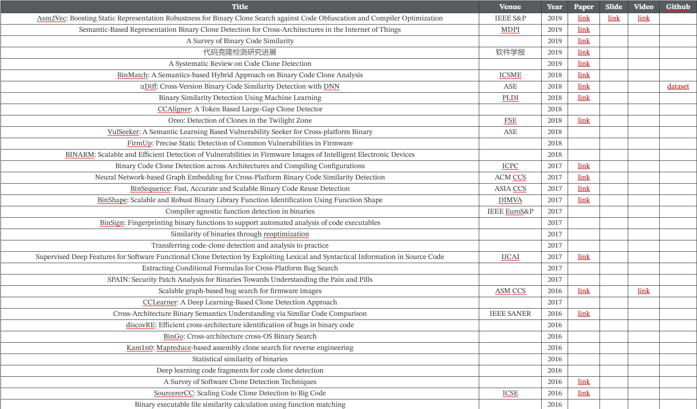

# Week 5

## Day29: 收集二进制代码克隆检测的论文资料

## Day30-31: 阅读代码相似性检测论文

> 传送门: [Open-source tools and benchmarks for code-clone detection: past, present, and future trends](https://dl.acm.org/doi/abs/10.1145/3381307.3381310)

- [x] 基本定义:
  * Code Fragment: 源代码的连续片段. 表示为`(l,s,e)`, l表示源文件, s表示起始行, e表示结束行
  * Clone Pair: 一对相似的代码片段, 表示为(f1, f2, type)
  * Clone Class: 一组相似的代码片段, 由 (f1, f2, ..., fn, type)表示. 类里两两不同的函数可以组成clone pair
- [x] 克隆分类: 
  * 语法克隆: 基于其文本相似
    * Type-1: 除开空格和注释外, 两个完全相同的片段
    * Type-2: 两个片段相似的代码, 只是重命名了一些标识符. 
    * Type-3: 相比Type-2, 片段可能经过了修改, 比如添加/删除了部分代码, 代码块中的语句经过了重新排序.
  * 语义克隆: 基于功能相似
    * Type-4: 语法上不相似但语义相似
- [x] 克隆检测步骤
  1. 预处理: 
    * 首先, 移除掉所有在比较过程中不会造成影响的元素
    * 其次, 通过多种方式(比如词法分析/AST)将源代码划分为单独的片段(例如类, 函数, 基本块, 语句等)将其转换为单元. 这些单元用于检查直接的克隆关系是否存在. 
    * 最后定义比较单元, 比如可以将单元分为各个token
  2. 转换:
    * 将源代码转换成相应的IR进行比较. 
    * 可以从源代码构造很多类型的表示形式, 例如token stream, 其中源码的每一行都转换成了token序列. 
    * 另一个常见构造就是AST. 以子树来进行比较
    * 此外, 可以提取为程序依赖图(PDG), PDG能表示控制和数据依赖关系, PDG通常使用源代码中的语义感知技术来进行子图比较.
  3. 匹配检测: 将每个转换的代码片段与其他片段进行比较, 以找到相似的源代码片段.
- [x] 旧时代检测技术
  * 1992年基于逐行比较, 从源代码文件中删除空格和注释
  * 1995年, 使用"参数化"的思想, 将唯一标识符(例如变量名, 方法名等)替换为唯一的字符. 来发现Type-1和Type-2型克隆
  * 1998年, CloneDR比较AST进行树匹配, 以找到精确匹配或近似精确匹配. 
  * 2002年. CCFinder扩展了检测的词汇性质. 它标记了源代码文件, 并使用了一组特定于语言的词汇规则来转换token流. 使用前缀树和新颖匹配算法, 计算令牌的常见前缀以发现代码复用
  * CP-Miner在代码克隆之间增加了bug检测
  * 2007年DecKard将AST转换为特征向量, 将向量聚类以减少比较. 能够检测Type-3类代码克隆
- [x] Benchmark
  * 2007年Bellon通过两个小型C程序和两个小型Java程序运行6个不同的代码克隆工具而收集的
  * 近年, BigCloneBench是IJaDataset-2.0(一个包含25,000个开源Java系统的大数据软件存储库)中800万个经过验证的克隆数据集. 包括四种主要克隆类型的项目内和项目间克隆.
- [x] [Open-source tools and benchmarks for code-clone detection: past, present, and future trends](https://dl.acm.org/doi/abs/10.1145/3381307.3381310)
  * Textual: 比较代码片段的`文本/字符串/词素`
  * Token-Based Approaches: 词法分析将源代码划分成一系列的token. 匹配token序列
  * Syntactical Approaches: 基于`树`或基于`尺度`. 基于树则是指AST, 用子树来识别相似区域. 基于尺度则是从源代码收集各种尺度来创建单独的向量, 通过比较向量来找到相似区域
  * Semantic Approaches: 主要基于图. 构造程序依赖图(PDG)来表示源代码的控制流和数据流. 比较两个PDG来识别程序两个版本之间语法和语义的差异. 
  * Learning Approaches: 分为机器学习和其他基于学习的技术. 跟学习方法类似的还有数据挖掘的方法. 

- [x] RetroWrite: Statically Instrumenting COTS Binaries for Fuzzing and Sanitization
- [x] Detecting Code Clones with Graph Neural Network and Flow-Augmented Abstract Syntax Tree: 提出了增强AST的想法, 增加了next关联以及`if/while/for/seq`结构的关联
- [x] Semantic Representation Learning of Code based on Visualization and Transfer Learning Patrick: 将源代码结构转换成图片(提取视觉结构), 通过训练好的图片分类神经网络生成代表图像结构信息的特征矢量. 得到特征矢量后再训练一个分类器用于分类或克隆检测. 
  * Plain Text: 将代码的纯文本表示形式渲染为黑白图像
  * Color Syntax Highlighting: 在纯文本的基础上增加代码高亮
  * Geometric Syntax Highlighting: 将语法关键字用特定的几何形状来表示(用于标记).
  * Ast in Condensed Format: 对AST进行可视化渲染. 
- [x] Clone Detection on Large Scala Codebases
  * SourcererCC: 将代码片段表示为一堆token, 通过比较token的重叠程度来评估相似度. 
  * AUTOENCODE: 使用`标识符`, `AST`, `字节码`, `CFG`生成嵌入输入给深度学习模型. 通过计算距离来评估相似度
- [x] DEEPBINDIFF: Learning Program-Wide Code Representations for Binary Diffing Yue
  * Bindiff: 在call graph和cfg上进行图的同构检测, 并通过`函数名/图边MD索引`来匹配函数和基本块.
  * DeepBindiff: 提取ICFG(过程间CFG). 还通过每个基本块生成特征向量, 也就是生成token嵌入和生成特征向量. token是取的操作码和操作数. 
- [x] Similarity Metric Method for Binary Basic Blocks of Cross-Instruction Set Architecture
  * 8个特征: 字符串常量, 数字常量, 转移指令数量, 调用数量, 指令数量, 算术指令数量, 子孙数量, 中间块
  * 汇编指令的标准化:
    * 常量: 立即数, 地址, 变量名, 函数名, 基本块标签
    * 寄存器: x86有14类寄存器 ARM被标准化为2类
- [x] Asm2Vec: Boosting Static Representation Robustness for Binary Clone Search against Code Obfuscation and Compiler Optimization Steven
  * 将CFG拆分成序列, 这里的序列是一个可能的执行路径.
  * 对于一个序列, 通过PV-DM, 用序列中相邻的指令去预测中间的汇编指令. 以此来训练.

## Day32: 阅读20年S&P最佳实践论文

> 传送门: [An Analysis of Pre-installed Android Software](https://arxiv.org/pdf/1905.02713.pdf)

- [x] Data Collection:
  * 使用Firmware Scanner做固件扫描, 使用Lumen来获得网络流数据. 
- [x] ECOSYSTEM OVERVIEW:
  * 首先分析预装APK里的证书, 通过证书将APK进行聚类, 用证书里的`Issuer`字段来区分组织. 不过厂商可以使用多个证书, 并且这些证书并非完全可信
  * 实践中有遇到使用`Android Debug`证书签名的APK, 这是开发时用的调试证书. 也有的证书仅提及`Android`未明确表明组织
  * 使用LibRadar++来识别APK中使用的第三方库. 预装的APK中存在第三方库的话, 是有风险监控到用户活动的. 实践表明存在第三方库, 比如Facebook的SDK有部分由设备厂商签名, 部分由运营商签名, 只有小部分由Facebook签名. 同样对于中国的一些SDK, 实践表明只有极小部分是由实际的第三方服务提供商签名, 也就意味着第三方库的引用决定在于APK的开发者. 
  * 对Google Play的APK进行爬取, 来判断有多少Android固件中预装的APK能在应用商店里公开获得. 实践表明只有9%的APK能在Google Play商店找到, 而找到的这部分也很少是预装APK的范畴, 主要是一些通信/娱乐/工具等的通用性APK
  * 使用Androguard提取APK里声明和请求的权限. 主要关注自定义权限, 因为预装的服务具有对系统资源的特权访问, 并且预装服务可能(非用户自愿地)公开关键服务和数据, 甚至绕过ANdroid的官方权限
- [x] Behavioral Analysis
  * 集成各种静态分析工具, 比如Androwarn, FlowDroid, Amandroid, APktool, Androguard.

## Day33: 阅读代码相似性检测论文

> 传送门: [LibDX: A Cross-Platform and Accurate System to Detect Third-Party Libraries in Binary Code](https://ieeexplore.ieee.org/document/9054845)

* LibDX: 从第三方程序包二进制中`识别出特征文件`, `提取特征`和`建立胎记`并最终构建一个`特征数据库`. 拿到样本的时候就提取特征跟数据库进行匹配. 由于匹配的时候会因为规模庞大, 因此LibDX的解决方案是识别逻辑功能块, 然后生成目标的基因图进行筛选. 
* LibDX需要处理多种文件架构和特征冗余的问题. 对于多种架构, LibDX试图提取平台无关的指纹做参考. 而特征冗余. LibDX使用的是源代码和二进制代码之间均不变的字符串常量做特征, 但是对于内部的代码复用是难以解决的. 这里分为两种: `父子节点`和`变体库`
  * 父子节点就是, 子节点未LibPNG, 父节点为OpenCV. 存在可能报告LibPNG的时候把父节点也匹配出来. 解决方案是分层. 
  * 变体库: 比如libijg是在libjpeg基础上重新开发, 这之间仅存在细微的差别, 所以应该将变种库的打分跟原始库一致
* 一些字符串常量在多个库中重复, 但不是由代码克隆而引起的. 比如有的字符串常出现在内存里, 因此需要一种权重函数来减少经常使用的字符串所贡献的分数. 
* 字符串的权重使用TF-IDF系数进行计算
* 利用文件的只读数据段, linux的`.rodata`, windows的`.rdata`, macos的`__cstring`. 

> 传送门: [Detecting Code Clones with Graph Neural Network and Flow-Augmented Abstract Syntax Tree](https://arxiv.org/pdf/2002.08653.pdf)

* 使用显式控制和数据流边缘扩展原始的AST来构造增强的FA-AST, 然后在FA-AST上应用两种不同的图神经网络来测量代码对的相似性. 
* 传统基于深度学习的方法: 使用神经网络为每个代码片段计算向量表示, 然后计算两个代码向量表示之间的相似度以检测克隆. 
* 尽管AST可以反映语法的结构信息, 但是不包含某些语义信息比如控制流和数据流
* 论文方法: 首先为程序创建图形表示, 然后使用图神经网络为代码片段计算矢量表示, 最后通过测量代码向量表示的相似性来测量代码相似性. 使用的两种GNN模型: 门控图神经网络GGNN和图匹配网络GMN. GGNN用于计算不同代码片段的向量表示, GMN用于测量代码对的向量表示的相似性. 

## Day34: 阅读代码相似性检测论文

> 传送门: [Order Matters: Semantic-Aware Neural Networks for Binary Code Similarity Detection](https://keenlab.tencent.com/en/whitepapers/Ordermatters.pdf)

* 论文提出了语义感知的神经网络来提取二进制的语义信息, 使用BERT对token级, block级和两个graph级别的任务进行与训练. 此外, 发现CFG节点的顺序对于图相似度检测很重要, 因此论文在邻接矩阵上采用CNN来提取顺序信息. 
* Gemini: 将CFG里的各个基本块转换成手动选取特征代替的另一种块(用特征向量来代替基本块), 然后用Structure2vec来生成图嵌入, 最后添加siamese架构来计算相似度.
  * 问题1: 每个块都用一个手动选取特征的低维向量表示, 这会导致大量的语义信息丢失. 
  * 问题2: 节点的顺序在二进制函数的表示中起了重要做哟个. 
  * 论文要点: 提出了语义感知模型, 结构感知模型和次序感知模型
* 语义感知模型: 使用NLP提取二进制代码的语义信息, CFG基本块中的token被视为单词, 而基本块视为句子. 论文使用BERT来对token和block进行预训练. 然后在标记语言模型任务(MLM)上标记要预训练的token, 并在邻接节点预测任务(ANP)上提取所有即将与训练的相邻基本块. 
* 另外还有两个图级的任务:
  * BIG(block inside graph task): 确定两个采样的基本块是否在同一个图内
  * GC(graph classification task): 区分该基本块属于哪一个平台/优化. 
* 结构感知模型: 结合使用MPNN和GRU来更新函数. 
* 次序感知模型: 设计了一个邻接矩阵来记录各个基本块的次序. 次序感知基于的前提是实践观察到其变化很小, 因此将该信息进行捕捉. 

> 传送门: [Similarity Metric Method for Binary Basic Blocks of Cross-Instruction Set Architecture](https://www.ndss-symposium.org/wp-content/uploads/bar2020-23002.pdf)

* 论文使用NMT(神经机器翻译)模型连接两个ISA的基本块, 提出的嵌入模型可以将来自任意ISA的基本块的丰富语义映射到固定维的向量中. 
* NMT模型: 建立在seq2seq架构上, 该架构包括`编码器`和`解码器`. 编码器将源文本编码为`上下文矩阵`, 解码器将`上下文矩阵`解码为目标文本. 在理想情况下(也就是源文本能够无损地翻译为目标文本), 上下文矩阵可以完整地包含源文本和目标文本的语义信息. 
* 论文建立了NMT模型将x86的基本块转换成ARM. 将这中间的上下文矩阵转换成固定维的向量来生成块嵌入. 然后通过块嵌入的相似性进行评估. 
* 汇编指令的标准化方法: 将常量分为`立即数/地址/变量名/函数名/基本块标签`进行符号化. 类似地寄存器也有集中类型的符号表示. 

## Day35: 阅读代码相似性检测论文

> 传送门: [A Cross-Architecture Instruction Embedding Model for Natural Language Processing-Inspired Binary Code Analysis](https://arxiv.org/pdf/1812.09652.pdf)

* 论文希望使得行为类似的指令(无论属于何种架构)都能具有相近的嵌入, 因此提出了`联合学习`的方法来生成嵌入. 该嵌入不仅能捕获架构内指令的语义, 也能捕获跨架构的语义关系. 
* 传统方法: 基于字符串, AST, token, PDG
* 论文构建指令模型, 希望学习到的跨体系结构指令嵌入, 不仅在单体系结构上保留聚类属性, 还要展现出不同体系结构之间的语义关联关系. 
* 对于NLP的OOV问题, 需要处理常量/地址偏移/标签/字符串等值. 解决方法就是符号化.
* 论文里将多种架构里的指令语义进行了相互关联预测. 比如对于两个上下文中, x86的指令跟arm的指令语义相同, 那么就可以用arm指令周围的指令来预测x86的等效指令. 但这里就需要找到指令的语义等价连接, 可以使用操作码对齐的方式, 然后通过DP的最长公共子序列来确定两个序列之间的最佳比对. 

> 传送门: [Statistical similarity of binaries](https://dl.acm.org/doi/10.1145/2980983.2908126)

* 论文受图的局部相似性匹配启发, 用统计的方法通过函数切片的局部匹配得分来计算全局的匹配得分. 
  * Decomposing the procedure into strands: 将函数分解成多个切片
  * Comparing strands: 使用program verifier通过假设输入等价并检查中间值和输出值, 以此来检查两条链在语义上是否等价
  * Statistical reasoning over strands: 用切片之间的局部证据得分(LES)的总和来计算函数之间的全局相似性得分. 同时放大了高LES表示的特有链的相似性得分, 减少了常见链的得分, 做了这样的差异化. 
* 使用工具将汇编转换成了中间验证语言(IVL). 对于需要比较的一对切片, 则会给定输入和输出的断言, 然后通过verifier来检查这些断言是否生效, 然后统计有多少变量是等价的. 
